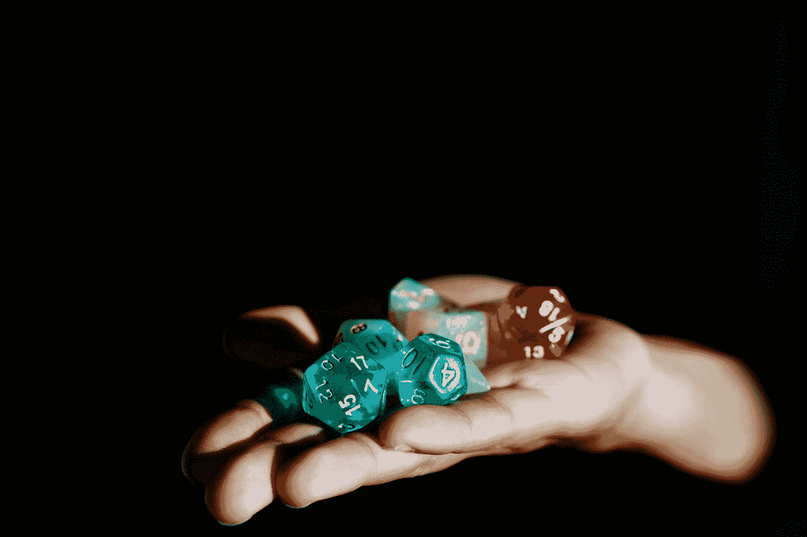

# 生活只是一个非常无聊的龙与地下城游戏

> 原文：<https://medium.com/swlh/life-is-just-a-really-boring-game-of-dungeons-dragons-1e48f956827c>

## 去参加工作面试？卷一个 D20。

Photo by [Alex Chambers](https://unsplash.com/@alexchambers?utm_source=medium&utm_medium=referral) on [Unsplash](https://unsplash.com?utm_source=medium&utm_medium=referral)

想象一下。四个十三岁的小男孩坐在父母的地下室里，周围放着几个形状奇怪的骰子，桌子上到处都是书名为《地下城主指南》和《怪物手册》的书，多力多滋空袋和十二包激浪。他们三个挤在一起，试图找出他们的下一步行动，第四个男孩坐在桌子的头上，脸上带着威胁的微笑。虽然它看起来像一大堆什么都没有，但我向你保证它不是。这些孩子正在寻找一个丢失的护身符，并把它归还给遗忘国度的公主，公主许诺如果他们成功，他们将得到与他们体重相当的黄金。他们站在一个神秘洞穴的边缘，试图制定一个游戏计划来打败等待他们的可怕的怪物。一声响亮的跺脚声震响了他们脚下的地面。一个 9 英尺高的山丘巨人走出来，挥舞着一根木棒。其中一个男孩说:“我想用我的战锤攻击他。”坐在桌子末端的他的朋友看着他，点了点头，回答道，“掷一个 D20。”

今年之前，我对龙与地下城的了解非常有限。我一直以为这只是书呆子们玩的桌游，我不会对它感兴趣。但随着年龄的增长，我越来越深地沉浸在“书呆子文化”中，我对幻想产生了热爱。《哈利·波特》是我读的第一部系列丛书，在很长一段时间里，它对我来说是一种逃避现实的方式。然后是《指环王》。然后，在我意识到之前，我的床头柜上已经堆了好几千页的奇幻小说。多年后，我发现自己非常想讲述自己的故事，塑造自己的角色，创造自己的世界。这就是龙与地下城的由来。在 21 岁的成熟年龄，我开始潜入 D&D 诱惑。要学的东西太多了，这一切都太令人兴奋了。我通过几个真实的龙与地下城播客了解了其中的机制，并立即爱上了游戏的协同讲故事功能。在我意识到之前，我开始在我的想象中搜寻角色的想法、故事的弧线和我自己自制的游戏机制。我需要尽快找到一个派对，否则我可能会爆炸。所以，当我的一个同事公开自己是 D&D 老兵时，我知道我找到了我的地下城主——简称 DM。我们又召集了几个共同的朋友，开始谈正事。每次治疗期间，我都有第一次读哈利波特时的感觉。我一头扎进故事里，忘记了其他发生的一切。我没有因为工作、学校或汽车故障而感到紧张。我只是一个年轻的半身人游侠，想和她的朋友们一起冒险。

随着我们的会话变得越来越复杂，我们每个人都越来越适应这个游戏，我开始意识到我是多么强烈地利用它来分散我对现实世界问题的注意力。每周有几个小时，我能够把自己从现实生活中转移到我们的竞选活动中，在那里，我的行动由骰子的滚动来决定。

如果我成功了，太好了！

如果我失败了，我想我们必须想出一个不同的方法来解决这个问题，并希望我下次能做得更好。

在游戏过程中，对知道接下来会发生什么的期待总是让你保持警觉。我开始希望我能以一个 20 面骰子来生活。没有什么看起来真的像世界末日，因为在一天结束时，我尽我所能帮助改变结果。但是，当我开始反思生活中好的和坏的事情时，我突然明白了。我们都在玩世界上最烂的龙与地下城游戏。虽然我们可能不会遇到巨人、妖精或龙，但我们每天都要面对自己的野兽，我们只是掷出一个 D20 来看看我们面对它们有多好。

今天晚些时候你要去参加一个重要的工作面试。卷一个 D20。

你得了 19 分，面试官当场就给了你这份工作！

你的 15 页研究论文今天到期。卷一个 D20。

你得了 13 分。你忘记打印了，但是你的教授让你在课堂上用电子邮件发给她。她从你的期末成绩中扣除 5 分。

你把你的车送去做例行保养——换油和好好调整一下。卷一个 D20。

你得了 1 分，严重不及格。机械师发现一堆问题。以 D6 的经济损失为例。

就像我在《D&D》中的角色一样，我越是把自己放在外面，获得的经验越多，我就越能让自己成长，提升自己的技能。当然，在我的二十面骰子上总会有致命的严重失败，但只要我不断鞭策自己学习，成为一个更好的朋友/女朋友/员工/学生/无论你能给我什么其他头衔，我就可以拍拍肩膀，站起来，再试一次。如果我 HP 低，我知道我需要给自己时间休息和恢复。如果我没有 HP，我肯定需要给自己时间充电，当我准备好的时候再起来(但我们都应该尽力避免这种情况)。

总的来说，《龙与地下城》应该是我逃避问题的另一种方式，所以我可以忘记我的工作、我的车、我的人际关系以及我的生活给我带来的压力。相反，它给了我一种新的方式来思考我遇到的障碍。D&D 教我，事情可以一下子变得颠倒过来，我需要接受这一点。我需要为此做好准备。我不能袖手旁观，希望事情按我的方式发展。当我们应该左转的时候，事情急转直下，我不会心烦意乱，不会有压力，也不会想放弃。如果我有一天暴击失败，我需要重新站起来继续掷骰子。每个问题都有一个创造性的解决方案，虽然现实生活中可能没有激动人心的剑斗、酒吧斗殴或魔法物品，但机制仍然是一样的。我是想用我的战锤打守卫洞穴的巨魔，还是想用咒语让他沉睡？不管怎样，掷出一个 D20 看看结果如何。如果出了问题呢？尝试新的东西。