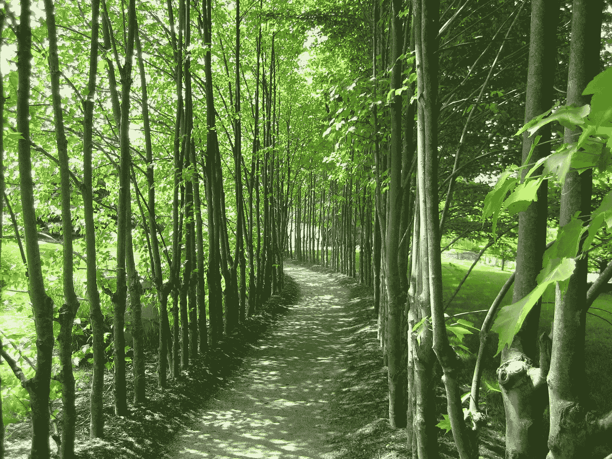

# 生活从来都不是单一的道路

> 原文：<https://medium.com/swlh/life-is-never-a-singular-path-a3fcd497327b>

你被授权去选择你想要的道路。

Photo by MJ Blehart — Grounds for Sculpture — Hamilton, NJ

在你的一生中，你会在不同的时间有不同的目标。有些是小目标，有些更大，影响更广。所有这些对你来说都很重要。

有时你会同时走在不止一条路上。例如:一边工作一边发展关系…