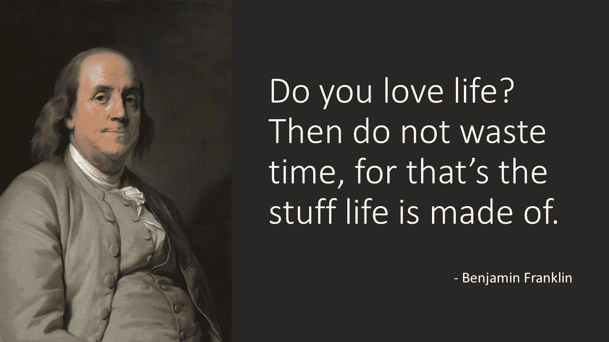

# 科学+本·富兰克林=生活课程

> 原文：<https://medium.com/swlh/life-lessons-of-ben-franklin-7a5ca806211d>

Source: [Joseph Duplessis](https://en.wikipedia.org/wiki/en:Joseph_Duplessis)

本杰明·富兰克林彻底改变了世界。他在美国的建立中扮演了如此关键的角色，他签署了《独立宣言》和美国宪法。虽然大多数美国人从 100 美元钞票上知道本·富兰克林，但大多数人并没有意识到他是有史以来最具生产力、改变世界的人之一。读了一些关于本的历史后，我有两个问题。他怎么…