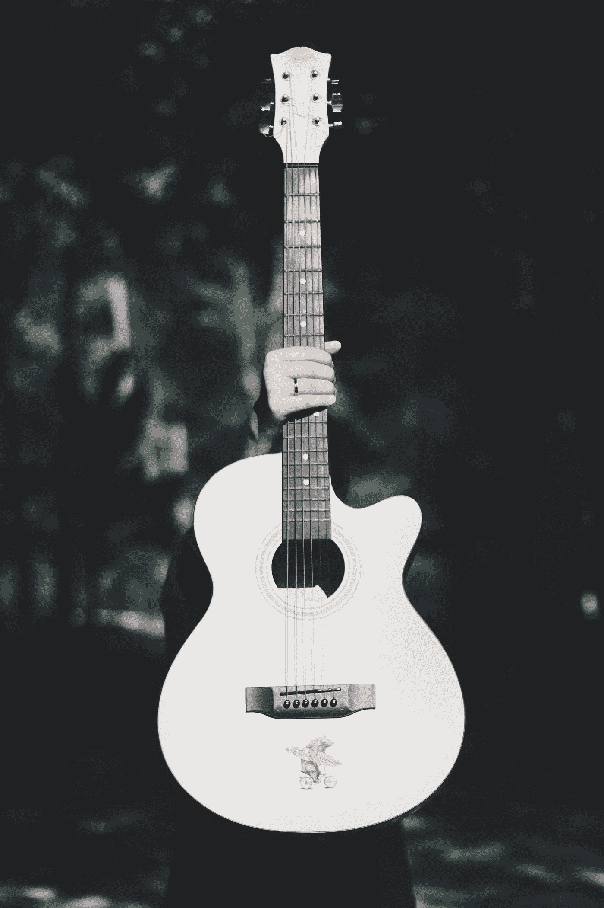

# 我作为音乐老师学到的生活技能

> 原文：<https://medium.com/swlh/life-skills-i-learned-as-a-music-teacher-7643e818e898>

Credit: Frame Harirak Unsplash

我一生中做过的最好的工作是当一名吉他老师。虽然我现在不教吉他，但这是我有过的最好的经历，我打算在不久的将来再去一次。在教吉他的过程中，我学到了一些非常宝贵的人生经验。以下是我学到的一些对我的生活有帮助的事情。作为一名作家，我已经将这些技巧运用到我的生活中。