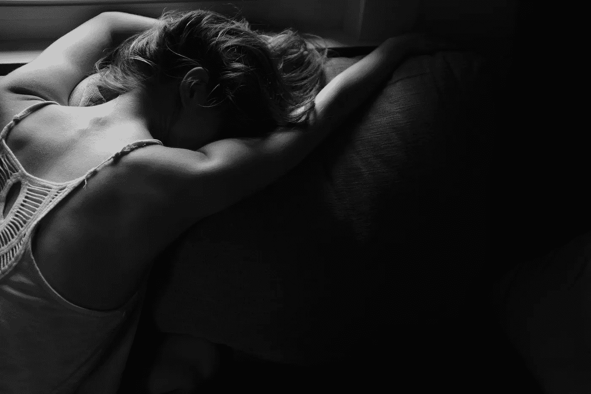

# 有时候，我想知道为什么我站起来会眼前一黑

> 原文：<https://medium.com/swlh/life-with-a-mystery-illness-10ab1826d3d9>

Photo by [Alex Boyd](https://unsplash.com/@alex_boyd?utm_source=unsplash&utm_medium=referral&utm_content=creditCopyText) on [Unsplash](https://unsplash.com/?utm_source=unsplash&utm_medium=referral&utm_content=creditCopyText)

我 14 岁时的一天，我在房间里完成一些几何作业。我突然意识到我要尿尿，所以我从椅子上跳起来去洗手间。

我记得的下一件事是躺在我的石瓦走廊的地板上，头砰砰直跳，混乱模糊了我的头脑。泪水开始控制不住地从我的脸上流下。