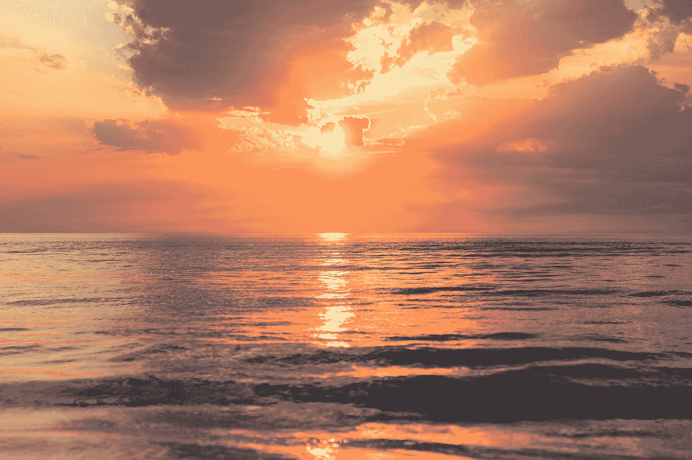

# 当你停止奋斗时，生活是令人惊讶的——只要“做自己”

> 原文：<https://medium.com/swlh/lifes-astonishing-when-you-stop-struggling-just-be-386abc6358be>

## 我们太沉迷于奋斗，以至于忘记了生活

[Source](http://Photo by Sebastien Gabriel on Unsplash)

我想去*那里*——在*那个海滩*，沉浸在壮丽的景色中。只要凝视照片，你就能感受到渗入灵魂的宁静。你的手指松开，你的肩膀放松一点…