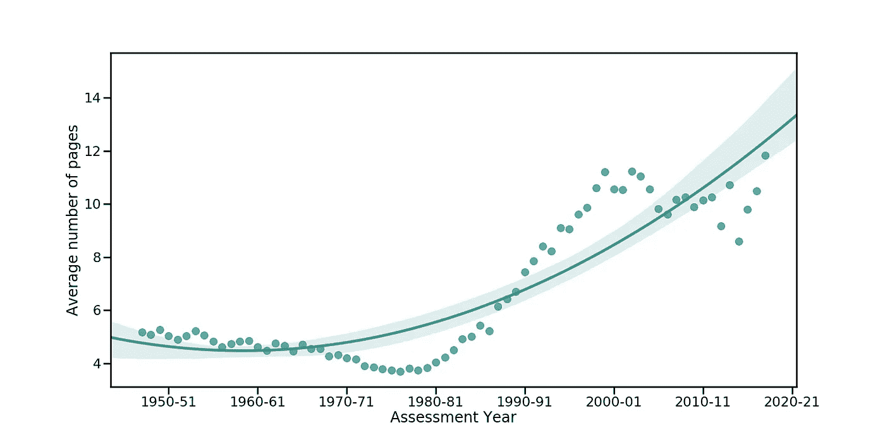
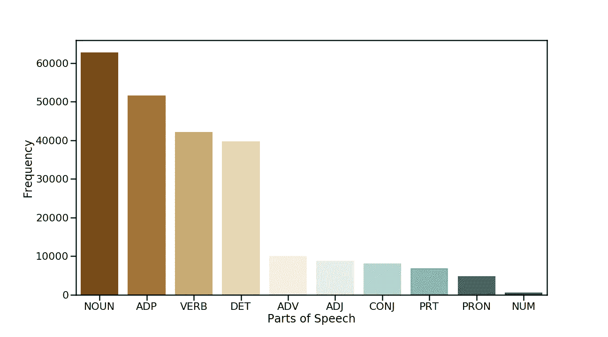
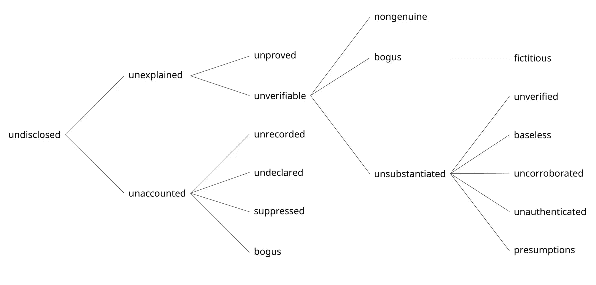

# 印度税务案的语言学分析(一)

> 原文：<https://medium.com/swlh/linguistic-analysis-of-the-indian-tax-case-i-df97ce2c2e4>


Photo by [Annie Spratt](https://unsplash.com/photos/0XPaD1D7oxI?utm_source=unsplash&utm_medium=referral&utm_content=creditCopyText) on [Unsplash](https://unsplash.com/search/photos/document?utm_source=unsplash&utm_medium=referral&utm_content=creditCopyText)

一个国家的法律主体，以书面形式表达的法律，是一个国家随着时间的推移而取得进步的惊人表现。法官写作风格的多样性的可感知的存在，同时，一个可辨别的一致性，是什么使这个语料库有趣的语言分析。我在一家[法律技术公司](http://riverus.in)工作，目的是尽量减少法律解释和应用中的主观性。我有机会在印度分析超过 22.3 万个所得税案例。这些数据包含了截至本文撰写之时在印度提起诉讼的所有税务案件，明显的例外是某些不可受理的法院和某些嵌入 pdf 的扫描图像的判决(*看着你，卡纳塔克邦高等法院*)。

## 通过裁判文书介绍法律

*   案卷(以下简称判决书)包含三个基本要素。一个半结构化的**页眉**，主体**部分**，以及一个结尾**页脚**。
*   判决书的**标题**包含诸如当事人姓名、代理律师、当事人信息(地址、潘、谭等)等细节。)，以及其他重要的案例详细信息(案例的助理年份、处置日期等)。 ***没有统一的写法，这些元素的顺序，也没有所有这些元素的存在。ITAT 一级缺乏统一性是可以理解的，因为它们是准司法机构，但是高等法院和最高法院在作出判决时没有理由不遵循一套规则。*** 本来可以结构化的集合现在是，充其量是半结构化的。
*   案件的**正文**部分以*有序*的方式包含案件的诉讼过程。[更多关于作为外行看案例。](https://towardsdatascience.com/anatomy-of-an-indian-tax-case-f1311379bc8c)
*   **页脚**部分包含姓名、判决日期、副本转发给谁的信息、主持案件的法官的数字签名以及关于案件的其他一些细节。
*   有时，判决包含脚注，在其他情况下，提供具体信息点的图像，或组织成表格的数据，以及非常罕见的对一些键入内容的手工修改。

# 脚本

案例文件是 PDF 格式的。使用的语言几乎总是英语。对此也有一些例外。在随机抽样的**万起**案件中， **195 起** (~2%)在判决文件正文中包含一个或多个梵文字符。下表显示了包含以梵文书写的文本的案件的法院分布情况:

数据是使用 Postgres 查询生成的，看起来像这样:

```
select *id*
from *table* s
where cast(s.*content* as varchar) similar to '%[\u0900-\u097f]%'
```

梵文字符的 Unicode 范围是`0900–097F`。[来源](https://jrgraphix.net/r/Unicode/0900-097F)。

# 判断大小

病例似乎在增加，无论是在数量上，还是在规模上。平均判决长度为`6.87 pages`。平均来说，一个判决有`2015 words`呈现在`69.27 sentences`中，合并成`22.89 paragraphs.`

这些年来，这一页的长度变化很大。这是一个二阶回归图，显示了评估年度的平均判断规模。三阶图是过度拟合的典型例子，因为该图在 2000 年至 2001 年后似乎下降了。



The rising size of Income Tax Judgment files.

## 关于案例数量的说明

不能忽视 20 年间判决数量增加了三倍。2010 年代末是印度法律史上的重要时期。几乎所有案件的数字化导致了外行人无需通过法律程序就能查阅的案件数量的大量增加。在此之前，病例可以大致分为 ***已报告*** 和 ***未报告*** 。简单地说，少数被认为是官方的法律期刊选择了他们认为重要的案例，并在他们的版本中发表。这意味着大量的案例没有被报道。相对容易获得意味着法官更喜欢参考已报告的案件，而不是未报告的案件，并将其作为裁决案件的先例。即使他们提到了未报道的案件，普通人也很难找到并理解手头的法律。2010 年前后，案件数量的突然增加扭曲了每一张法律图表。

深入观察表壳本身，会发现三个独特的特征:

## 公然引用

法官和法院成员在对援引先例向法院提出的论点作出回应时，应该总结本案中的先例。这适用于两种类型的先例——与当前案例相关的和不相关的。然而，已经出现了大量引用先例的案例。

*People Interactive (I) P. Ltd .诉 Asst Cit 4(3)* 是 2013 年处理的案件。这个案例完全符合我们的分析。由 Shri**T3【Shailendra Kumar Yadav】和 Shri Ramit Kochar**裁决**法官引用了另一个案件 *Biocon 有限公司诉 DCIT(LTU)* 进行陈述。事实上，它从提到的案例中一字不差地引用了惊人的 **10 页**。出了 30 页判决书，直接引用了 10 页！毫无疑问，到目前为止，People Interactive 一案在整个法律世界中被作为先例引用了零次。与智能转述相对的直接引用，是判断不断膨胀的原因之一。**

[更清晰判断写作的七个步骤](http://mja.gov.in/Site/Upload/GR/7Steps_2ClearerJudgmentWriting.pdf)写着，

*“引用已判决的案件时，应当谨慎、节俭地选择判决书的段落。只有那些表达了正在讨论的命题的部分才应该被引用。理想情况下，这可能不超过一两句话，而不是一段或几段。”*

## 法律纠纷

*   所得税专员诉 B. N. Bhattachargee。是一个流行的案例。它被引用在超过 1800 个其他税务案例中。V. R. Krishna Iyer 谈到了这个案例中的一个问题，

> 黑钱和巨额逃税这两种吸血鬼般的罪恶，加上利用金钱的力量来阻止对白领罪犯采取行动，对国家的健康和财富构成了可怕的威胁。

*   Rajiv Shakdher 在 Shanti Bhushan 诉所得税专员一案中写道

> 没有两个人处理心灵的事情是相似的；经常困惑，如何处理它，这就是为什么一个著名的作词家这样阐述这个非常特殊的困境:迪尔-E-丹娜 Tujhe Hua Kya Hai Akhir Ess Dard Ke Dawa Kya Hai。(这里心是拟人化的。有人问它，它得了什么病？治疗这种疾病的方法是什么。)

这些判断无疑构成了一本有趣的读物。

按照法官意图的方式解释判决越来越费力。 [BBC](https://www.bbc.com/news/world-asia-india-39672453) 和其他几个消息来源呼吁高级法院和高级法院的法官在法律判决中引入不必要的天赋和错误。虽然[在判决中添加笑脸](https://www.telegraph.co.uk/news/2016/09/14/smile-high-court-judge-uses-emoji-in-official-ruling/)可能会引起争论，但法官应该采取必要的措施，以确保判决对另一名法官、律师或外行人来说足够简单。法律术语和深奥语言的使用应限于绝对必要的情况。

## 您说什么？凯娅·卡哈·艾普内？

Ajay Kumar 对 ITO，ITAT·阿格拉的案子，假设一个人有阅读和理解的能力:

> 《处罚令》第 7 段规定如下:
> " Uprokt Varnit tatt hyon Se Spasht Hai Ki Nirdhariti Dwara Rs。16，59，914/-Ki Aay Ke samband me Galat byo Rey Prastut Kiye Gaye Hain Evam tatt hyon Ko chhi paya Gaya，Hai "。

这个案例没有解释这一行翻译成什么。

许多判决包含了印度英语，这是印度语和英语的完美结合。这种语言明显缺乏相关的解释。

这不同于使用梵文书写特定的语言(马拉地语、印地语等)。)这有其自身的一系列缺点。包含 Devnagari 文字的案例成为可研究法律领域的盲点，因为它们不能被传统地搜索到法律的特定点。也很难找到一个案例中的先例。当然，这只是排除了少数熟悉这门语言的人。

# 箱子里面

我选择了 2018 年处理的 100 个随机案例来分析所使用的语言类型。文本的**正文**部分被清除，以忽略非字母数字字符，并进行一些其他基本的文本预处理，以确保排除异常值。这里有一个图表，显示了这些案例中出现的各种词类。



What’s in there? [Legend](https://www.nltk.org/book/ch05.html)

虽然 **4.3%** 处的`Adverbs(ADV)`和 **3.7%** 处的`adjectives(ADJ)`强调了某些点，但在大多数情况下是可以避免的。

另一个有趣的发现是，未披露的词语**和*位列使用频率最高的 15 个形容词之列。加在一起，它们的出现频率是 **862** 这些必然涉及收入来源，并可能属于*逃避评估的收入*，但这是另一天的主题。***

**语言灵活性的展示是显而易见的，像'****【秘密地】******【恰当地】*** 这样的副词出现了 5 次。***

**一点复杂的查询可以在查询级别生成 n 元语法:**

**我不想手动搜索美丽的英文单词。所以我训练了一个单词到 vec 的模型，根据这个法律语料库提出单词向量。我能够使用这个训练过的模型提取所有与未公开相关的单词。相关单词的直观表示如下:**

****

**Word2vec**: undisclosed** and co.**

**文件越来越大，税务纠纷的数量成倍增加，这就提出了一个问题，法官和法院成员是否应该有意识地努力改变他们的写作风格，以利于可读性，说服力和易于理解？**

# ****结尾备注:****

1.  **临时命令、诉讼记录和其他非最终文件不在此分析之列，因为它们包含琐碎的信息。**
2.  **撰写判决书的艺术是一本有趣的读物。**
3.  **所得税专员诉 t . n . ara vinda Reddy——“当一个人怀旧地想起逃避现实的诗句:“无知是福，聪明是愚蠢的时候，法庭上有时会出现令人窒息的学术观点。“阿门！”**
4.  **文中提到的所有案例都可以在这里找到[。](http://www.riverus.in)**
5.  **加州大学洛杉矶分校法学院的沃洛赫教授和印第安纳大学毛雷尔法学院的坦福德教授分享了一份 12 页的优秀指南，以解决常见的法律写作问题。[更](https://lnkd.in/fcq8rAz)。**

**[](https://medium.com/swlh)**

## **这篇文章发表在 [The Startup](https://medium.com/swlh) 上，这是 Medium 最大的创业刊物，拥有+429，678 名读者。**

## **在这里订阅接收[我们的头条新闻](https://growthsupply.com/the-startup-newsletter/)。**

**[](https://medium.com/swlh)**