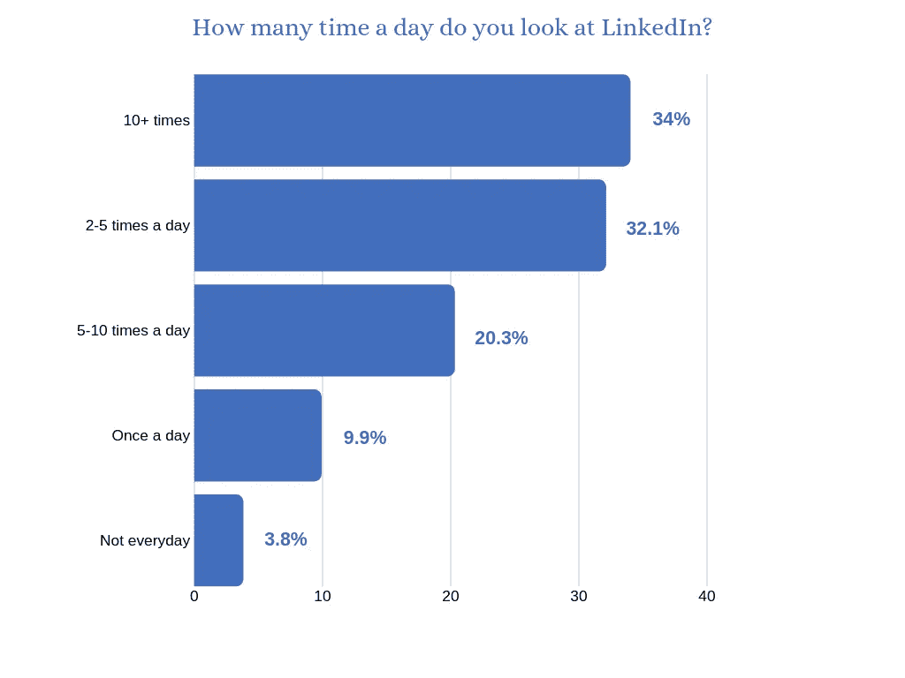
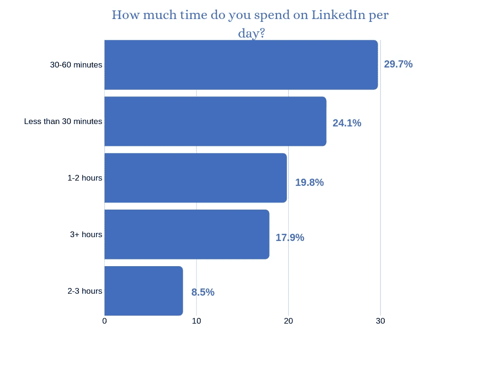
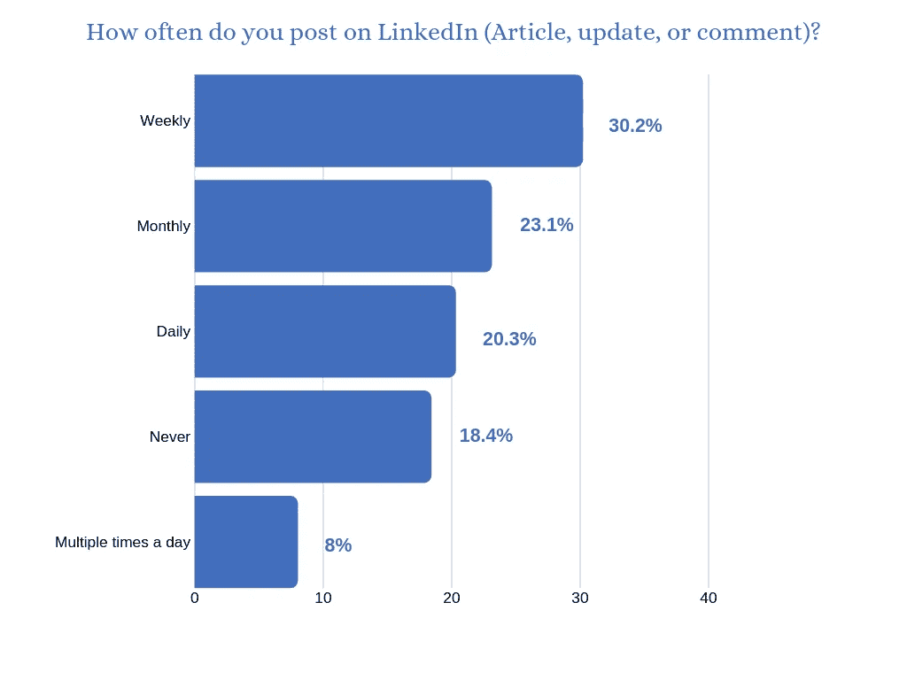
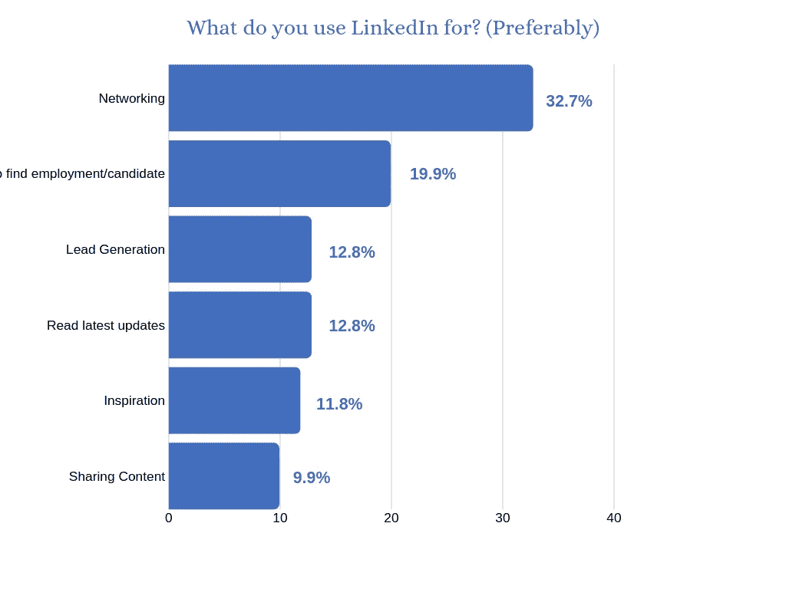
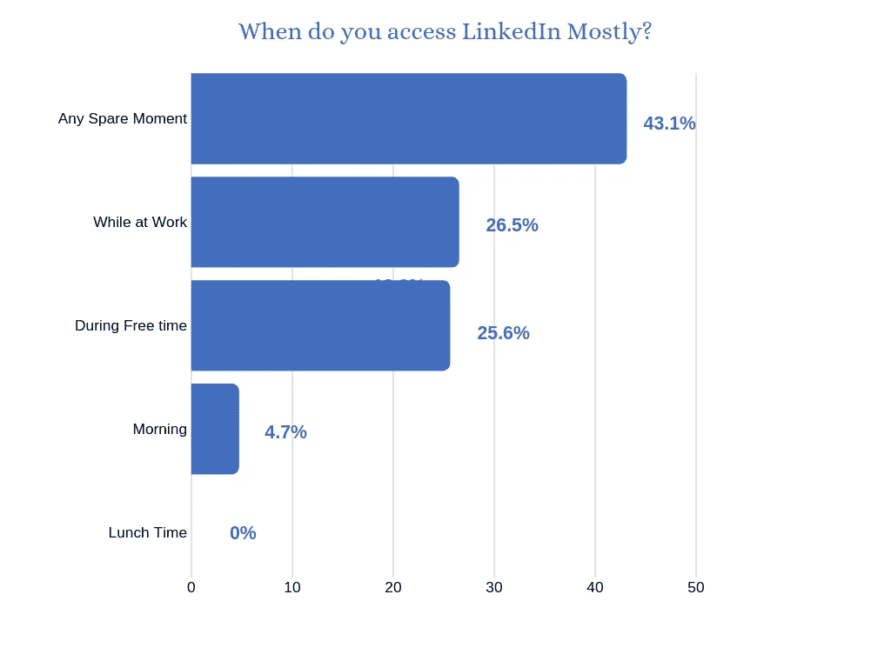
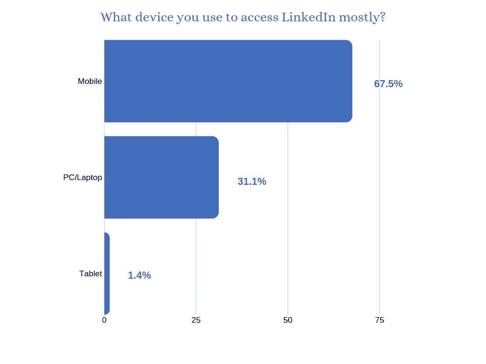
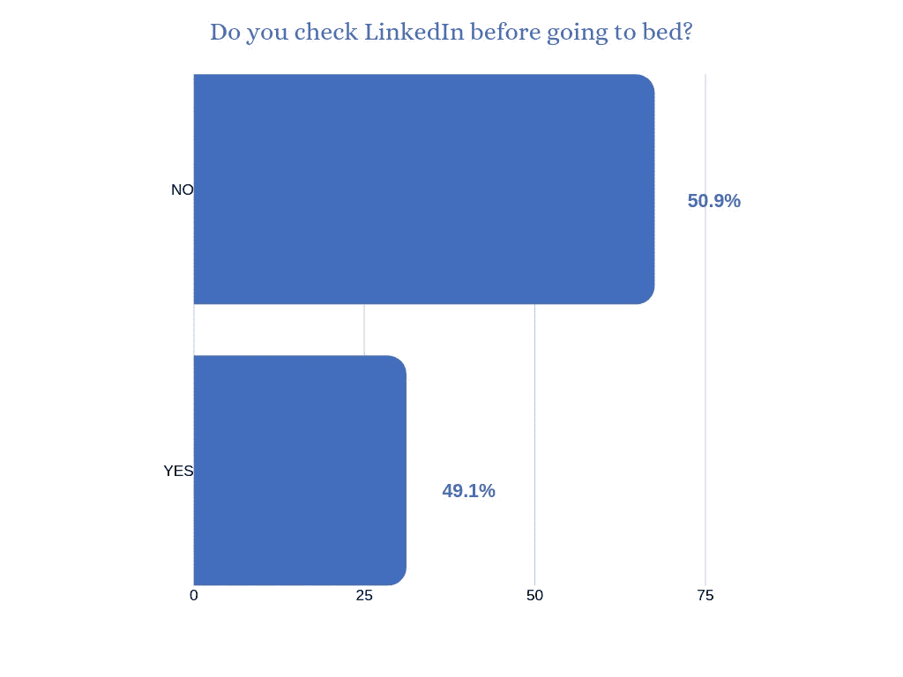

# 2019 年领英用户行为调查报告

> 原文：<https://medium.com/swlh/linkedin-users-behavior-survey-report-2019-206fff168536>

Image Source: [Pixabay](https://pixabay.com/photos/woman-grown-up-within-people-3083377/)

我不知道你怎么样，但我爱上了 LinkedIn。🙂

当我在 2014 年第一次开始使用它时，我曾认为它是一个工作平台。

但是我错了。很快我就明白了它的价值。在我的职业生涯中，LinkedIn 对我帮助最大。

我真的相信 2019 年是 LinkedIn 年。

我再说一遍…

2019 年是 LinkedIn 之年。这是黄金时期。

LinkedIn 拥有超过 5 亿会员，是 B2B 营销人员用来分发内容的头号渠道。

在过去的 12 个月里，用户在 LinkedIn 上的行为急剧增加。

我做了一个 1 分钟的调查来了解你如何使用 LinkedIn。我总共收到了 220 份回复。我想对每一位花时间参与调查的人说声谢谢。

结果在…

# 1.34%的会员一天看 LinkedIn 超过 10 次。

# 2.会员每天花在 LinkedIn 上的时间超过 30 分钟。

# 3.超过 30%的成员每周发布内容。

# 4.32.7%的会员使用 LinkedIn 进行社交。

# 5.43.1%的用户在任何空闲时间访问 LinkedIn。

# 6.67.5%的人在移动设备上访问 LinkedIn。

# 7.49.1%的用户会在睡前查看 LinkedIn。

# 行动呼吁

想了解如何利用 LinkedIn 的力量吗？ [**点击**](http://prepawan.com/linkedin-mastery-course/) 进入您的领英大师课程

*原载于*[*prepawan.com*](http://prepawan.com/linkedin-users-behavior-survey-2019/)

## 这篇文章发表在 [The Startup](https://medium.com/swlh) 上，这是 Medium 最大的创业刊物，拥有+434，678 读者。

## 在此订阅接收[我们的头条新闻](https://growthsupply.com/the-startup-newsletter/)。

