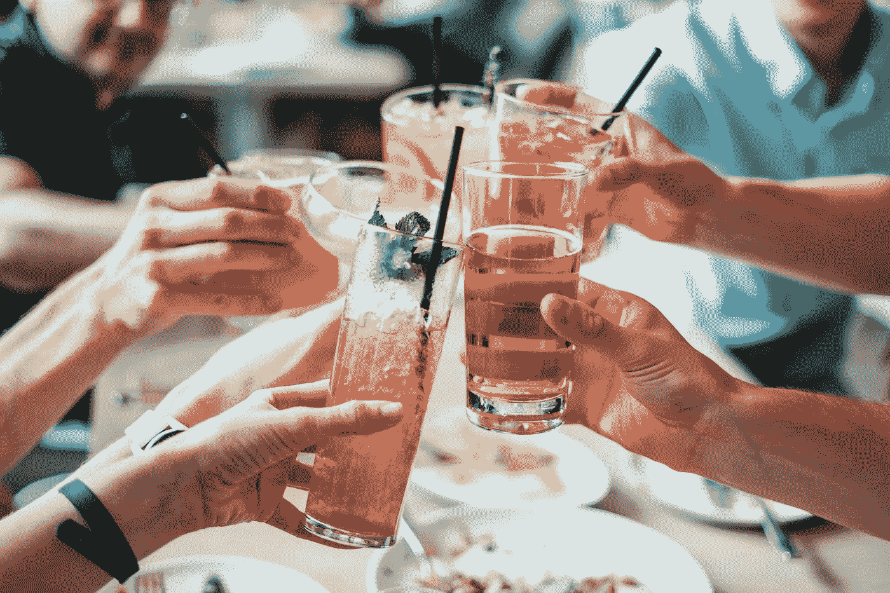

# 液态创业:准备好迎接更多的柠檬吧

> 原文：<https://medium.com/swlh/liquid-entrepreneurship-get-ready-for-more-lemonades-79f54d3fd163>

*几十年来，饮料是如何推动越来越多的公司成立的，以及为什么这些公司现在在风险投资家中需求量很大*

当我第一次参加在德国科隆举办的最大、也可以说是最重要的食品和饮料贸易展 Anuga 时，大量不知名的饮料公司的展位很容易就被知名品牌占据了一倍。然后，730 天后，同样的地点，同样的足迹，但完全不同的公司。

虽然我在不同国家的商店促销展示、赞助活动和路演中见过一些参展公司，但没有一家公司回来招揽买家。然后，1460 天后，我连第一次见过的大部分牌子都想不起来了。

饮料是快速消费品行业中最具吸引力的类别之一。为什么？首先，非酒精饮料可以带来 50%到 75%的平均毛利率。酒精饮料可以赚取 30%到 46%(请记住，这些是来自欧洲和美国的公共和私人数据的汇总值)。

更不用说这两个类别的原料通常只需要不超过三个不同的供应商。一家提供基础液体，一家提供香料/酒精，还有一家装瓶公司。所有这些都大大减少了外部因素对最终产品的影响。

当消费者在寻找更天然/有机/不含脂肪的产品时，像 [Synergy Taste](https://www.synergytaste.com/beverage-flavors) 、[Beverage Flavors International、](http://www.beverageflavorsinternational.com/)和香精香料巨头 [Givaudan](https://www.givaudan.com/) 这样的公司，只是创造了全球口味的一些企业，每个人都可以跨越国界和市场。

## 我们在哪里

2000 年代是能量饮料时代，人们开始转向方便包装的酒精饮料，如罐装普罗塞克和盒装葡萄酒。大约从 2010 年开始，人工调味的 H2O 在欧洲和美国获得了越来越多的商业关注。精酿啤酒在美国市场变得尤为重要，意大利和法国等国家只是在这十年的后半期才开始流行起来。杜松子酒主要被商业化，作为威士忌制造商增加现金流的工具[，在 2013 年至 2017 年达到顶峰](https://www.prnewswire.com/news-releases/global-gin-sales-on-the-rise-despite-falls-in-volume-613801393.html)，市场份额大幅增加，补充滋补品制造商也是如此，产量和需求都有所增加。

上述每种产品都是价格相对较低的产品(尽管一些品牌确实实现了溢价定位)。所有这些都导致我们对一些特别的、与众不同的东西的需求不断增长。

## 我们要去哪里

[Waitrose](https://www.waitrose.com/content/dam/waitrose/Inspiration/Waitrose%20&%20Partners%20Food%20and%20Drink%20Report%202018.pdf) 在其 2018/19 年度报告中，Mezcal 被列为酒精饮料类别中的后起产品之一。部分原因是欧洲和墨西哥之间的自由贸易协定，该协定将 Mezcal 加入了[地理标志产品](http://ec.europa.eu/trade/policy/accessing-markets/intellectual-property/geographical-indications/)的清单，以及消费者对不同产品的持续需求。

在高档酒类中，波旁酒、威士忌和清酒正在崛起，尽管还没有哪个品牌在这个领域发展出成功的全球品牌。但这一类别的收购很活跃，如卢森堡 SPI 集团收购的 Kentucky Owl，日本三得利公司收购的 Marks，Campari 收购的 Wild Turkey。虽然他们还没有收购，保乐力加已经购买了肯塔基州一家酒厂的股份。

随着 2020 年东京奥运会的临近，优质清酒/波旁威士忌热潮兴起，并准备吸引普通消费者，同时仍为鉴赏家留下空间。

酒精饮料的趋势似乎相对明显。这些公司都在追求通过收购建立全球品牌的战略。

## 风味特征

一个更有趣的发展发生在非酒精饮料领域。调味饮料，至少没有人工成分，但最好有额外的好处，正在上升。像 Fever Tree 这样从杜松子酒和滋补品热潮中受益匪浅的公司，可以建立一系列高质量的纯天然饮料，定位高于 Schweppes 这样的现有公司。

它的西西里柠檬水作为一种进步的风味正在引领潮流。它不是作为点心装瓶的，每瓶只有 0.15 升。然而，它的风味特征表明了我们的前进方向。

他们正在利用与一个几个世纪以来一直生产柠檬的地区的联系，给它一个天然产品的信誉。略带酸味，没有任何甜味，顾客认为这是一种全天然的产品。随着精酿啤酒运动在其类别中的展示，这将让位于更难和不太主流的口味。

在酒精方面，尼格罗尼和 Spritz 一直在向主流市场引入众所周知的香精，但大多数消费者并不特别喜欢。马提尼推出了一系列优质的苦艾酒变种，部分是为了增加其在尼格罗尼开胃酒季节的份额，通常被称为夏季，具有向高端市场转移的额外好处。

## 把它绑在一起

美国对起泡饮料不断增长的需求已经让位于诸如 Pellegrino、Bubbly 等品牌的调味产品线。

从中期来看，将会出现具有额外益处的调味饮料，如 [Olipop](https://drinkolipop.com/) (美国)[、抹茶 Works](https://www.matchaworks.co.uk/) (英国)，以及各种柠檬水和类似果汁的组合，以满足消费者的需求。受到高维生素含量和消化益处的广泛宣传的营养价值的驱使。

康普茶一直是重新崛起的参考饮料，自 2018 年夏天以来，它在美国再次受到关注。尽管它有益于生物群落，但还没有一个全国公认的品牌，而在欧洲，它已经成为超市货架上的常见景象，尽管大部分是本地生产的。

欧洲目前对更成熟口味饮料的需求，如精酿柠檬水和经常出现的康普茶，为大型制造商提供了抢购品牌的机会，如果他们不打算自己推出品牌的话。

像英国的 [Can O](https://www.canowater.com/) 这样的包装老手，可能永远也不会成为一个类别的领导者，因为它还没有得到应有的承认，因为它肯定太早上市。但它引领了更可持续和更方便的食用量，这将是消费者对更高质量产品的需求。

正如 [Aperols US campaign 2019](https://digiday.com/marketing/instagram-friendly-aperol-spritz-became-drink-summer/) 所示，这些饮料提供了在短时间内运送大量易于制作的产品的机会，这主要是由营销驱动的。

无论我们谈论的是 DTC、柠檬水即服务还是已经获得牵引力的手工品牌，商业激励都是一样的。饮料对风险投资者非常有吸引力，因为它们能在一两个季节内产生高回报。

他们成功所需要的唯一一件事是一个坚实的营销活动，为相当富裕的观众量身定制，这将在泡沫破裂时迅速产生回报。

大多数都比不上香槟泡沫的质量。一种种植了几个世纪的饮料，不是作为一种服务而是一种享受。但话说回来，他们也没必要。

*特别感谢* [*巴里·W·恩德维克*](/@kaizenbarry) *对这篇文章的编辑建议。*