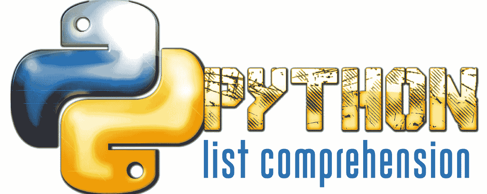

# 为初学者列出 Python 3 中的理解

> 原文：<https://medium.com/swlh/list-comprehensions-in-python-3-for-beginners-8c2b18966d93>



所以你正在学习用 Python 编码，你开始理解如何处理不同的数据类型、变量、条件语句、`for`循环、`while`循环，也许你对此感觉很好。

然后你会看到这样的东西:

```
[x+1 **if** x >= 5 **else** x+2 **for** x **in** l]
```