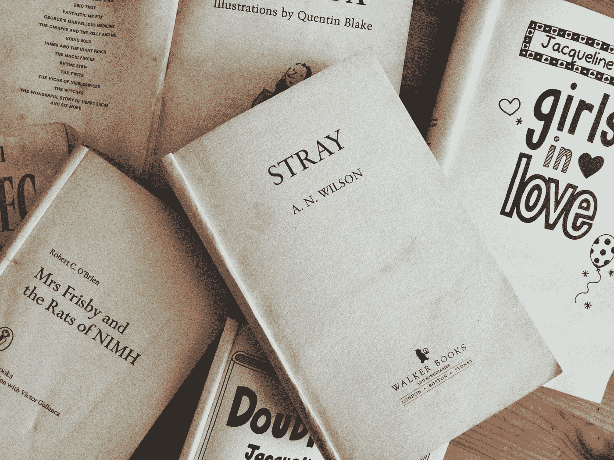

# 文学传记:童年书籍如何塑造我们

> 原文：<https://medium.com/swlh/literary-biography-how-childhood-books-shape-us-eba38069d44b>

去年看了露西·曼根的*书虫*(在这里复习了一下[)。是对童年阅读的探索。这是一次美妙、温暖、怀旧的怀旧之旅，我强烈推荐它。](https://meganbidmead.com/2018/03/03/bookworm-lucy-mangan/)

在我攻读学位的入门课程中，我们在第一单元学习的内容之一是语言学传记，即什么地方、什么人和什么事塑造了我们说话的方式。其中一个…