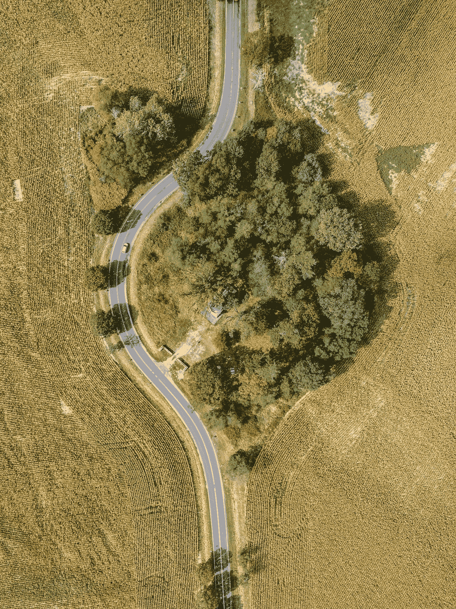

# 生活和思考。一个在当下，一个在心中。为什么两者都很重要。

> 原文：<https://medium.com/swlh/living-and-thinking-one-is-in-the-present-the-other-in-the-mind-why-both-matter-5e9aaabb7801>

思维和生活在平行的轨道上运行。前者由头脑决定，而后者与当下一致。思考与过去或未来有关，是一项个人事业。生活是一种集体努力，涉及与自然的共生关系。思考可以在孤立中进行，深入大脑，并且…