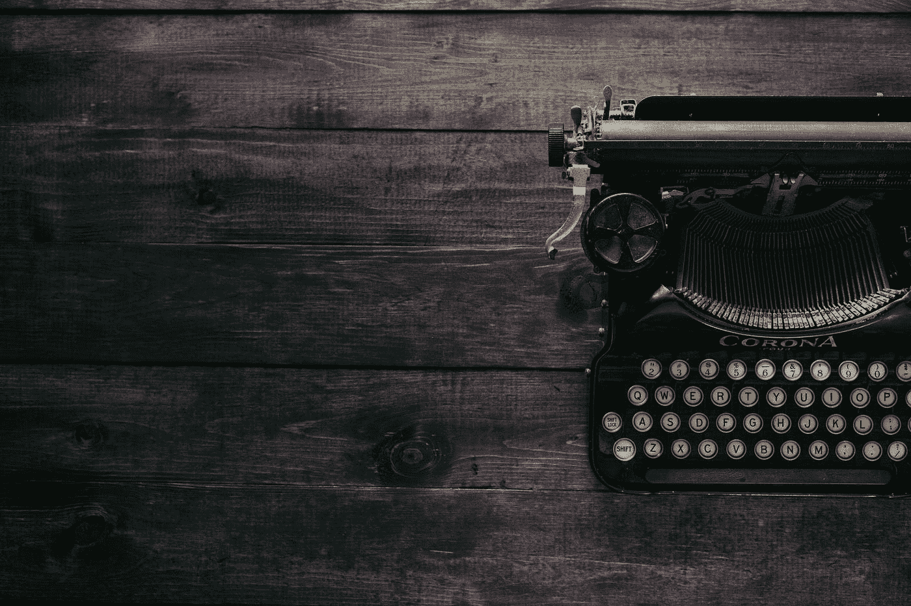

# 生活在一个艺术家社区使我成为一个更好的作家

> 原文：<https://medium.com/swlh/living-in-an-artists-commune-has-made-me-a-better-writer-171059e2d8c6>

Photo by [Patrick Fore](https://unsplash.com/@patrickian4?utm_source=medium&utm_medium=referral) on [Unsplash](https://unsplash.com?utm_source=medium&utm_medium=referral)

“公社”这个词名声不好。部分是好莱坞的错，部分是住在你们大学宿舍 112 号房间的那些无法忍受的人的错，部分是[合法的]国际旅行恐怖故事的错。

在“公社”前加上“艺术家”的复数所有格，天啊，还有什么听起来如此自命不凡…