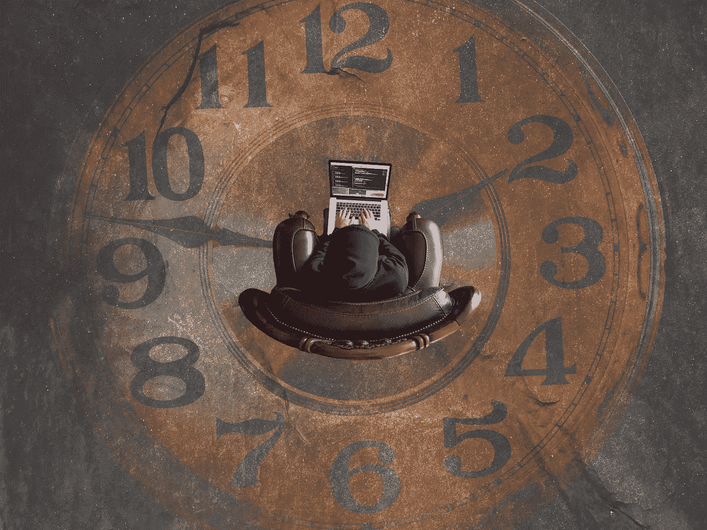

# 生活在浪费和失去宝贵时间的恐惧中？

> 原文：<https://medium.com/swlh/living-in-fear-of-wasting-and-losing-valuable-time-287c8186cc3c>

# 所有事情都需要适度，包括时间管理

Photo by [Kevin Ku](https://unsplash.com/photos/aiyBwbrWWlo?utm_source=unsplash&utm_medium=referral&utm_content=creditCopyText) on [Unsplash](https://unsplash.com/search/photos/stress?utm_source=unsplash&utm_medium=referral&utm_content=creditCopyText)

## 我逐渐认识到并欣赏时间的价值、重要性和不可再生性。