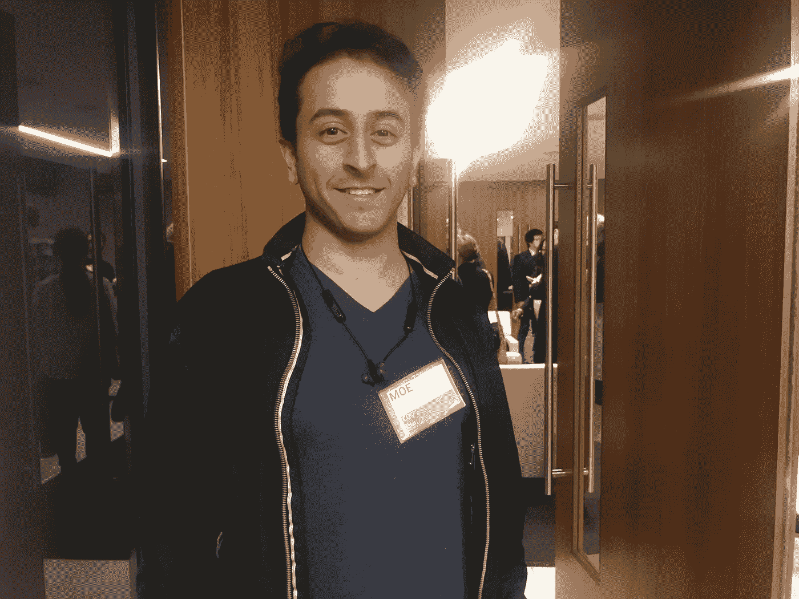

# 住在你的办公室里——科技创业文化面试#7

> 原文：<https://medium.com/swlh/living-in-your-office-tech-startup-culture-interview-7-cbb8a2374092>

为了攻读 VU 阿姆斯特丹大学的人类学硕士学位，我正在旧金山进行为期三个月的实地考察，在那里我研究科技初创企业文化。通过像这样的观察、非正式谈话和采访，我试图发现创业背后人们的日常行为和动机。我的重点主要是工作-私人生活的情况，以及人类和他们的业务之间的纠缠。

在对 [Khalid](/swlh/24-7-workday-i-pitch-under-the-shower-interview-5-tech-startup-culture-e09886518421) 进行采访后，我得到一个消息，采访感觉不太对劲。他想补充更多关于联合创始人的信息，因为他们是他的故事中不可或缺的一部分。所以我被邀请去他们的创业公司，和他们交谈。房子在里士满郊外。哈利德打开门，把我介绍给其他船员:工程师在厨房做饭，他的妻子在客厅看着网飞，莫·阿尔卡西姆坐在办公室里。客厅和办公室用折叠隔墙隔开，所以声音在两个房间之间传播。办公室是两张拼在一起的桌子，一块白板，软木板，笔记本电脑，还有很多办公用品。Khalid 坐在他的笔记本电脑后面，我也坐了下来。

Moe 在 2014 年加入这家初创公司之前是全职工作。起初，他在空闲时间飞往旧金山，并在这家初创公司做兼职。他解释说，他们与很多人交谈，并几次改变了关注点。他问我是否知道他们以什么名字开始的。我不知道。墙上挂着一个大横幅，上面写着公司的名字。Khalid 向我展示了一个类似的横幅，但仍然挂着该公司的旧名称。半小时后，我注意到我喝咖啡的杯子上也有同样的标志。

在某个时候，他们都决定辞去工作，全职创业。他们搬到一起，申请孵化器和加速器。他们获得了资金，并通过加速器扩大了他们的网络。在来到旧金山之前，Moe 已经在多个国家生活过，所以在国外生活并不是最困难的事情。

这是新的东西，具有挑战性的东西。当我问他辞职的感受时，他说，我们还年轻。内心深处，你知道你随时可以回到任何工作岗位。你可能得努力工作才能得到那份工作，但迟早你会得到的。我宁愿每天做些不同的事情。我喜欢解决问题。

莫从小就被鼓励成为一名企业家。他(他父亲)总是告诉我要尝试新事物。他的父亲尝试了六七种不同的生意，但都失败了。他一度几乎破产，后来他经营起一家企业。我重述了这个故事，在这个故事中，我称他父亲的最后一笔生意很成功。“嗯，很成功……”他回答道。我问他如何定义成功。“快乐”

“你快乐吗，”我问。

是啊！尽管我想有更多的钱，但是我不想要一份普通的工作。他说，你需要有胆量，或许不要引用我的话。我们大笑。“你需要勇气，”他改写了这句话。

哈立德在采访中补充道:“他是我们的不二人选。”。

他们几乎每天都在创业公司工作。今天是周末，所以他们边工作边喝啤酒，放松一下。“如果我们不在笔记本电脑上工作，我们就会谈论工作、头脑风暴或计划。”Moe 解释说，他们试图每六个月重新定义一次他们的战略，与此同时，变化变得越来越小，因为他们正在弄清楚他们要去哪里。存活时间长的创业公司会随着市场的变化而变化。教条主义者会陷入困境。教育部所做的很大一部分是计划和执行。他是商业和风险专家。

走出家门是很费钱的。“这是旧金山，”他说，就像他说天空是蓝色的。他们时常外出:客户会议、推介活动、投资者会议。就个人而言，每周至少一次:比如去散步。莫伊的一天从早上 6 点左右开始。喝着咖啡，他会坐下来查看电子邮件、社交媒体、新闻和信息。如果你饿了，你就吃东西。他一天吃三顿饭，因为否则他会头痛。这和看着一天从 8 点到 5 点是非常不同的，因为在这里你不能完成。你不能。“因为你住在你的办公室里，”他思考了几秒钟，“但是……你的办公室也是你的房子。”。所以在工作时间——如果你这么定义的话——我可以休息一下，”

莫伊说，每个创业公司都有不同的文化，他看到的一些现象是，创始人、联合创始人和早期员工合不来。他们互相施加高压，导致失败。这里是文化战胜冲突。哈立德对此表示赞同:“我们更像一家人。我们还在这里的原因之一是，无论情况如何，我们都团结在一起。穆罕默德点头道:“我们度过了非常艰难的时期。非常艰难的时期。他解释说，当他们的第一个想法胎死腹中时，情况非常艰难。他们必须改变整个公司。他看着墙上的横幅，新的名字；新策略。

工程师走进来，给每个人美味的食物。我们开始谈论硅谷系列。我说我都看过了，这比我想象的更像是真的。莫伊和哈立德同意。它是如此准确，”莫伊说，对于在创业公司工作的人来说，这更像是一部惊悚片。挫折让它成真。

他们选择住在一起，以降低成本。燃烧率越低越好。把办公室放在家里，一起住可以节省很多钱，这意味着他们有更多的时间。但这也能让他们保持理智。

Moe 解释了他是如何处理压力情况的。他看着以前的人，和其他成功的故事。当他看到他们经历了什么，这有助于他正确看待事情。每次当他们遇到问题时，他都会想:这不是会杀死我们的东西，而是我们必须解决的东西。生活比你的问题大得多。我的问题很小，足以解决它们。这么多人毁了生活，这没什么。

我们谈论推销，以及获得第三方的意见对不陷入房子的泡沫有多重要。有些人接受不了批评。很多创业公司都有自我。他们都有自我。我们有自我。有的管不了小我。只要你的意图是好的，你就能管理好自我，现实一点。你会到达那里的。

薇薇恩·施罗德
[推特](https://twitter.com/VivienneSchrode)
[LinkedIn](https://www.linkedin.com/in/vivienne-s-6955445a/)

