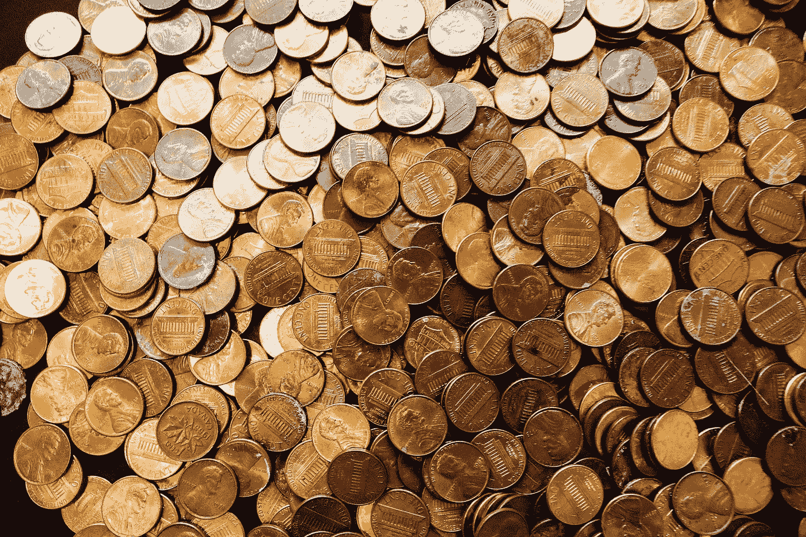

# 过着节俭的生活

> 原文：<https://medium.com/swlh/living-on-the-cheap-13039361ff30>

## 省下一便士等于积少成多

Image by [Olichel Adamovich](https://pixabay.com/users/Olichel-529835/?utm_source=link-attribution&utm_medium=referral&utm_campaign=image&utm_content=912716) from [Pixabay](https://pixabay.com/?utm_source=link-attribution&utm_medium=referral&utm_campaign=image&utm_content=912716)

贫穷和选择过廉价生活是有区别的。多年的贫穷影响了我节俭生活的能力，但节俭生活是我和我丈夫现在选择的生活方式。没有人比我的黎巴嫩丈夫更擅长过节俭的生活，所以如果你和你的另一半在省钱的策略上达成一致会有所帮助。如果你是单身，你可以做决定…