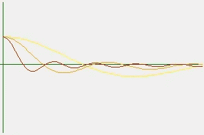

# 寻找合适的冲动

> 原文：<https://medium.com/swlh/looking-for-the-right-impulse-7a8d28b74afb>


Photo by [Austin Chan](https://unsplash.com/@austinchan?utm_source=unsplash&utm_medium=referral&utm_content=creditCopyText) on [Unsplash](https://unsplash.com/search/photos/looking-for-the-right-impulse?utm_source=unsplash&utm_medium=referral&utm_content=creditCopyText)

## 线性对于统计大量案例是多么有用。

有时，我们感兴趣的是从一个更全面的角度对整个系统进行概述。这种观点产生了促使我们做这样或那样事情的一般印象。然而，这些冲动是在对整个环境进行第一次扫描以得出高度复杂的结论之后产生的。

在这篇文章中，我将展示一种机制，它将帮助我们理解如何找到几十个相互关联的问题，以及如何处理它们。

首先，这是一个脉冲*X(t)=δ(t)*；这意味着:如果 *t* 等于 0，返回 1，否则返回 0。


我们特别感兴趣的不是处理一个有条件的函数，而是处理一个我们可以**相加**和**相乘**的结构。出于这个原因，我们将把它表示为余弦和，如本书所述[1]:


Impulse in a period T

这意味着我们不能在孤立的冲动下工作…


A repeated Impulse every 15 minutes

我们也不使用可导函数来构建峰值。



After 4 (yellow), 8 (orange) and 16 (red) summands

所以，很容易构造你自己的脉冲函数，

```
from math import pi, cos, sin
class Impulse:
    def __init__(self, period, U=0, m=80):
        self.m = m
        self.period = period
        self.sc = {}
        self.ss = {}
        self.sc[0] = -U
        for k in range(1,m):
            self.sc[k] = 1 / (m-1) / (1-U)

    def __call__(self, item):
        S = 0.0
        for i in self.sc.keys():
            S += self.sc[i] * cos(i * item * 2*pi  / self.period)
        for i in self.ss.keys():
            S += self.ss[i] * sin(i * item *2*pi / self.period)
        return S
```

我们可以用我添加的新参数玩一玩:

```
>>> X0 = Impulse(20)
>>> X0(0)
0.9999999999999987
>>> X0(1)
-0.012658227848101278
>>> X1 = Impulse(20, U = X0(1))
>>> X1(0)
1.0001582278480998
>>> X1(1)
0.00015822784810127707
>>> [round(X0(t), 2) for t in range(21)]
[1.0, -0.01, -0.01, -0.01, -0.01, -0.01, -0.01, -0.01, -0.01, -0.01, -0.01, -0.01, -0.01, -0.01, -0.01, -0.01, -0.01, -0.01, -0.01, -0.01, 1.0]
>>> [round(X1(t), 2) for t in range(21)]
[1.0, 0.0, 0.0, 0.0, 0.0, 0.0, 0.0, 0.0, 0.0, 0.0, 0.0, 0.0, 0.0, 0.0, 0.0, 0.0, 0.0, 0.0, 0.0, 0.0, 1.0]
```

因此，这意味着我们总是可以根据我们的需要，加入一些有助于改进公式的小改进。

## 合并线性运算

真正有趣的是，我们可以将信号乘以一个标度，移动它并添加另一个信号。这里有一个提议:

```
def clone(self):
        result = Impulse(self.period,  m=1)
        result.m = self.m
        result.ss = self.ss.copy()
        result.sc = self.sc.copy()
        return resultdef scale(self, value):
        for k in self.ss.keys():
            self.ss[k] *= value
        for k in self.sc.keys():
            self.sc[k] *= valuedef shift(self, x=0, y=0):
        factor = 2*pi/self.period
        if not 0 in self.sc.keys():
            self.sc[0] = y
        else:
            self.sc[0] += y
        for k in self.sc.keys() :
            b = self.sc[k]
            a = self.ss[k] if k in self.ss.keys() else 0
            self.ss[k] = a * cos(-k*x*factor) - b * sin(-k*x*factor)
            self.sc[k] = a * sin(-k*x*factor) + b * cos(-k*x*factor)
        for k in self.ss.keys():
            if k in self.sc.keys():
                continue
            self.ss[k] *= cos(-k*x*factor)
            self.sc[k] = self.ss[k] * sin(-k*x*factor)def __add__(self, other):
        result=self.clone()
        result.period = self.period
        for k in other.ss.keys():
            if not k in result.ss.keys():
                result.ss[k] = 0
            result.ss[k] += other.ss[k]
        for k in other.sc.keys():
            if not k in result.sc.keys():
                result.sc[k]=0
            result.sc[k] += other.sc[k]
        return result
```

所以现在我们可以这样测试它:

```
>>> X = Impulse(20)
>>> Y = X.clone()
>>> [round(X(t), 2) for t in range(21)]
[1.0, -0.01, -0.01, -0.01, -0.01, -0.01, -0.01, -0.01, -0.01, -0.01, -0.01, -0.01, -0.01, -0.01, -0.01, -0.01, -0.01, -0.01, -0.01, -0.01, 1.0]
>>> [round(Y(t), 2) for t in range(21)]
[1.0, -0.01, -0.01, -0.01, -0.01, -0.01, -0.01, -0.01, -0.01, -0.01, -0.01, -0.01, -0.01, -0.01, -0.01, -0.01, -0.01, -0.01, -0.01, -0.01, 1.0]
>>> X.scale(2)
>>> Y.shift(1, .01)
>>> [round(X(t), 2) for t in range(21)]
[2.0, -0.03, -0.03, -0.03, -0.03, -0.03, -0.03, -0.03, -0.03, -0.03, -0.03, -0.03, -0.03, -0.03, -0.03, -0.03, -0.03, -0.03, -0.03, -0.03, 2.0]
>>> [round(Y(t), 2) for t in range(21)]
[-0.0, 1.01, -0.0, -0.0, -0.0, -0.0, -0.0, -0.0, -0.0, -0.0, -0.0, -0.0, -0.0, -0.0, -0.0, -0.0, -0.0, -0.0, -0.0, -0.0, -0.0]
```

此时，我们可能会注意到，我们相加的信号必须始终具有相同的周期，因为我们的求和函数不会计算两个周期的最大公约数，也有可能我们感兴趣的是表示方波信号，而不是参考文献中所示的脉冲信号…，但出于本文的目的，我们将留在这里。

## 寻找更多有趣的应用

想象一下，我们想知道有多少种方法可以在一个集合中找到能够恰好相加一个量的数字子集。

例如:在[1，1，3，4]中，我们可以达到#{[1，1，3]，[1，4]} = 2 种情况，其中它们的集合的元素相加正好是 5。

在[3]中我们可以看到**背包问题**的定义:


Is there a subset which elemens sum an exact value?

所以我们看到，与计算结果不同的是，如果有一个案例，当我们考虑计算案例的数量时，它就会出现。当谈到建立差异时，有一个约定，它包括包含符号 **#** ，并提到我们计算*锐*。

所以，#背包的意思是:*有多少个子集能够恰好相加一个量。*

在[3]中，我们可以到达其他已知的问题，想象我们有一组数字，我们是否能够将它们分成两部分，其中对每一部分求和，结果是相同的？

例如，让我们使用我们的类…

```
def sharpPartition(*L):
    X = Impulse(sum(L)+1, m=100)
    for Z in L:
       Y = X.clone()
       Y.shift(Z)
       X.shift(-Z)
       X += Y
    return round(X(0)/2)
```

在上面的代码中，我们将得到的信号向左向右移动，最后相加。在 t=0 中，我们将找到分区数量的两倍，就像在#Partitions[1，2，3] = #{({1，2}，{3}，{1，2})}/2 = 1 中一样

所以，

```
>>> sharpPartition(1,2,3)
1
>>> sharpPartition(1, 2, 3, 5)
0
```

#分区和#背包有什么联系吗？在[3]中我们可以得出这样的关系:


Implementing Partition we will have constructively the implementation of Knapsack

所以我们只需要用同样的符号定义分区:


所以代码可能是:

```
def sharpKnapsack(value, *L):
    L2 = list(L[:])
    L2.append(value +1)
    L2.append(sum(L) + 1 - value)
    return sharpPartition(*L2)
```

所以我们可以做一些简单的测试…

```
>>> sharpKnapsack(5, 2, 3)
1
>>> sharpKnapsack(3, 2, 3, 1)
2
```

除了[3]中暴露的问题，您还可以在[2]中找到更多的等价问题…

## 如果一切都那么美好…

正如我在下一篇文章中解释的那样，

[](/datadriveninvestor/hard-life-for-a-rebellious-mind-2ea7693ebfe0) [## 叛逆思想的艰难生活

### 最高效的机器被鄙视。

medium.com](/datadriveninvestor/hard-life-for-a-rebellious-mind-2ea7693ebfe0) 

闪光的不都是金子。这就是为什么我们的模型既有好消息也有坏消息。从我自己的符号来看，我们可以像一个手册一样构造指令来解决[2]中的大多数#NP 问题，但是我们必须考虑这些事情仅仅是使用本文方法的近似值。

有一种可能性是，我们可能需要以更精确的方式来表示冲量，以便计数结果会更精确。

设置固定数量的被加数的优点是它不依赖于输入的大小，但是它依赖于它们使用的值的范围。

所以，让我们来研究一下这段代码:

```
def sharpSumZero(summands, *E):
    I = Impulse(2*max(E)*len(E), U = 0, m = summands)
    for X in E:
        I2 = I.clone()
        I2.shift(x = X)
        I += I2  
        I.shift(y = -I(0.5))  #S1
        if round(I(0),0) > 0:
            I.scale(round(I(0), 0) / I(0)) #S2\. 
        else:
            I.shift(y = 1 - I(0))
    return int(round(I(0),0))
```

在这种情况下，我们考虑计算有多少子集的总和正好为零。为此，我们管理了两个特殊区块#S1 和#S2，以便更准确地得出结果。

所以我们用这个词条来测试一下:`L = [1] + [-1]*40` ，它是 a -1 和 40 种加到零的方法。所以正确结果是 41(考虑算空集)。

```
>>> sharpSumZero(800, *([-1]+([1]*40)))
190
>>> sharpSumZero(1600, *([-1]+([1]*40)))
41
>>> sharpSumZero(3200, *([-1]+([1]*40)))
772850686
```

正如你所看到的，它有一个完美的工作范围(像过拟合和欠拟合问题)。有必要考虑我们的库工作的误差容限，以及代表脉冲的傅立叶级数工作的误差容限。否则，结果是可以预料的。

# 参考

[1] Oppenheim，A. Willsky，a .和 Nawab，S. (2016)信号与系统。诺伊达:皮尔森，2016。

[2] Garey，M .和 Johnson，D .(2009)计算机和棘手问题。纽约[美国]:弗里曼，2009 年。

[3]卡普，R. M. (1972)可归约性阿蒙组合问题。米勒和撒切尔。)，计算机计算的复杂性，全会出版社，纽约，85-103。