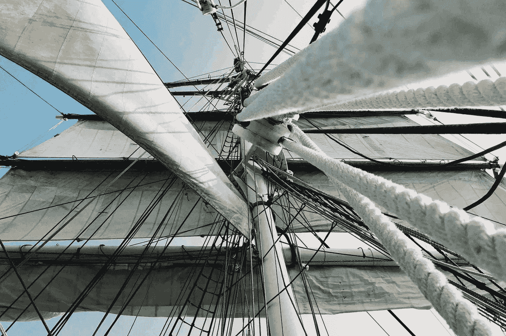

# 纳尔逊勋爵，特拉法尔加战役和战略教训

> 原文：<https://medium.com/swlh/lord-nelson-the-battle-of-trafalgar-and-a-lesson-in-strategy-51d76e9c48e5>

这项措施可能被认为是大胆的，但我认为最大胆的才是最安全的——纳尔逊勋爵

Photo by [Tanner Mardis](https://unsplash.com/photos/vYJ7Qd0zAec?utm_source=unsplash&utm_medium=referral&utm_content=creditCopyText) on [Unsplash](https://unsplash.com/search/photos/tall-ships?utm_source=unsplash&utm_medium=referral&utm_content=creditCopyText)

我一直在听理查德·鲁梅尔特写的一本很棒的书，书名是《T2:好策略坏策略》。在我过去一年听的 100 本有声读物中，这是我第三次发现自己在读完这本书的时候买了一本硬拷贝。这是我希望分享的…