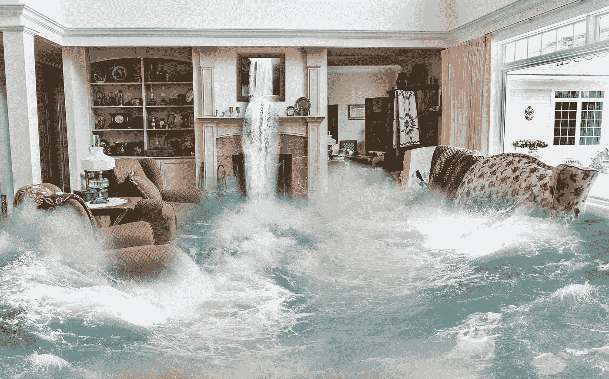

# 迷失在洪水中

> 原文：<https://medium.com/swlh/lost-in-the-flood-dbcfdcf4d1fd>

一个主要电器故障如何迫使重新评估寿命

Image by [Pete Linforth](https://pixabay.com/users/TheDigitalArtist-202249/?utm_source=link-attribution&amp;utm_medium=referral&amp;utm_campaign=image&amp;utm_content=2048469) from [Pixabay](https://pixabay.com/?utm_source=link-attribution&amp;utm_medium=referral&amp;utm_campaign=image&amp;utm_content=2048469)

想象一下:你在一个周六的早晨醒来，准备开始你的周末。你打算为你和你丈夫做法式吐司。然后你听到他的声音从地下室飘了上来，语气马上就暗示出了问题。你低头发现你的地下室充满了水，多亏了你的旧的和失败的水箱热水器。一个主要的伤亡…