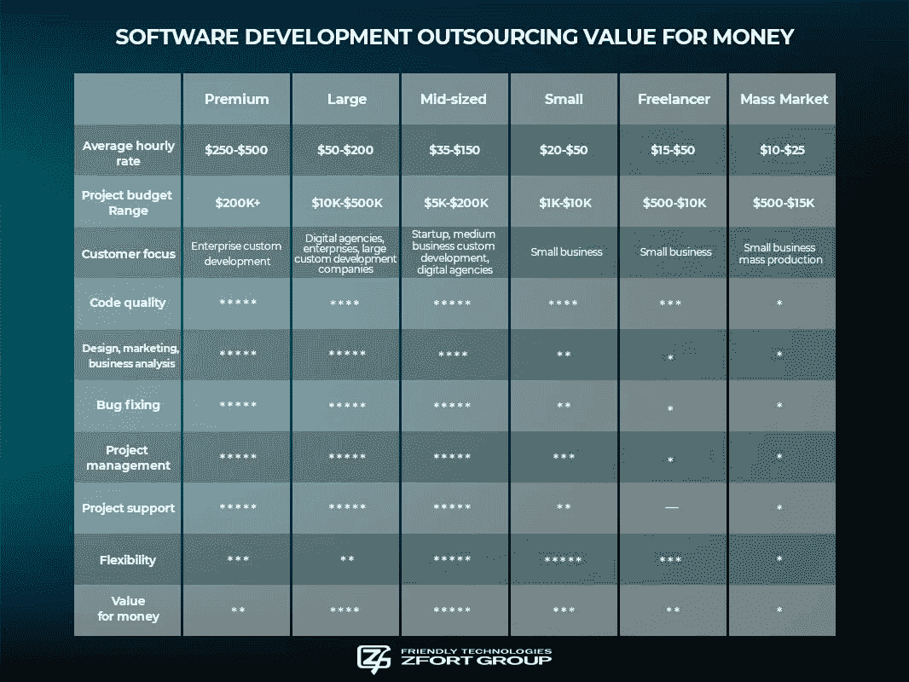
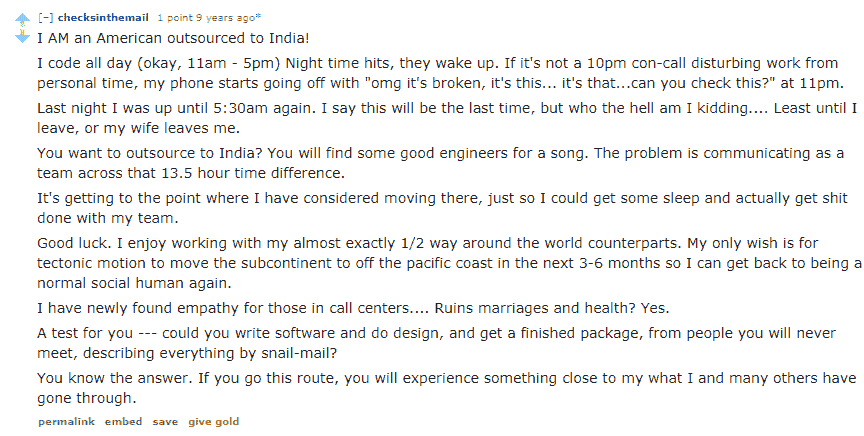

# 低成本软件开发:买好看还是买二遍

> 原文：<https://medium.com/swlh/low-cost-software-development-buy-nice-or-buy-twice-99b923173807>

学习高质量软件开发服务真正价格的指南。

> **同一项目。同样的要求。价格不同。这有什么不好？**

你可以收到从 5000 美元到 150000 美元不等的相同 RFP(征求建议书)的报价，这是一个公开的秘密。它们有什么不同？如何选择供应商？最后，对选定的提供商有什么期望？

别担心。我们将通过分享一些关于如此巨大的价格区间的原因以及你可以从每种类型的公司中期待什么的基本想法来帮助你填补空白。

> Zfort 集团是一家 T2 软件开发公司。我们提供符合成本效益的最佳解决方案来满足您的需求。[联系我们](https://www.zfort.com/contacts?utm_source=MEDIUM&utm_medium=The_StartUp&utm_campaign=Offshore_vs_Onshore_Software_Development:_Which_One_Is_Better?)免费咨询。

在基本层面上，这些提供者可以按照下述方式进行划分。

# “大众市场”

倾向于提供**基于模板的开发**的公司。它们是最低的成本，并且经常交付质量最差的软件产品。通常，客户不得不将他们失败的项目交给更有经验的供应商，既浪费时间又浪费金钱。

他们从来不会对项目说“不”，也不会关注客户的成功。他们倾向于雇佣最便宜的开发人员，甚至将你的项目外包给一个成本非常低的自由职业者。他们的绝对目标是在你的项目上花费尽可能少的时间。

你不应该期待高质量的维护和支持服务。在大多数情况下，这些公司甚至不提供这种类型的服务，因为代码质量很低，他们的客户需要雇用另一个代理来完成他们的项目。

他们的客户通常是批发商，他们没有规范背后的任何业务和营销作业。哦，他们甚至没有说明书。通常，大众市场供应商的项目以“失败”告终。

# 自由职业者

结果在经验和自我管理的水平上有很大的不同。雇佣一个自由承包人经常会变成一种风险。

很难讲出你期望支付的基本费用，因为它们的费率很大程度上取决于个人因素，如经验、投资组合、地点，甚至他们的自尊。所以价格区间很大。

你可以以每小时 35 美元的价格雇佣一个杰出的 guru 开发者，然后欣喜若狂。同样，你也可以丢掉每小时 150 美元的工资，独自一人在某个偏僻的地方完成未完成/失败的项目。

自由职业者赚钱的另一种方式是，你的项目将成为他们的兼职活动。好吧，当你能把你的爱好转化为收入的货币化来源时，这很好，但是很有可能你的自由职业者会很快筋疲力尽，在工作完成之前辞职。

你在考虑雇佣一个自由开发者或设计师吗？嗯，只列出那些已经从事自由职业至少一年的人。自由职业者一旦意识到自己无法胜任，就会重返全职工作，这是常有的事。没有什么好惊讶的，因为不可能一次单独处理几个复杂的项目。

# 小公司

这种类型的公司通常是由自行编码的开发人员建立的。公司规模通常是 1-10 名员工，包括管理层。由于缺乏资源，他们无法承担大型复杂项目，也无法降低开发过程中的风险。

结果在很大程度上取决于管理层的道德水平，因为他们没有任何既定的流程。

# 中型公司

这些公司通常有多达 200-300 人。他们的建议通常是基于每小时的估计。中型公司通常拥有成熟、高效和透明的管理流程。

这种类型的公司通常非常适合作为长期合作伙伴，因为它们已经具备:

*   有定制软件开发经验；
*   拥有相关技术的经验，能够快速为您的项目找到额外的资源；
*   设计，搜索引擎优化和商业分析等附加服务的经验。

与价格更低廉的大众市场竞争对手相比，这些公司的费率更高，效率更高，交付速度更快，质量更高。

# 大型公司

这些公司通常由雇员和办公室的数量来定义。他们通常分布在尽可能多的国家(例如乌克兰、白俄罗斯、保加利亚、波兰)，因为他们的流动率很高，对新人才的需求也越来越大。

通常，超过 500 人的公司会建立他们自己的教育中心和实习项目，根据你的要求来储备专家。但也有可能，你的项目会被一个更资深的同事托付给一个正在成长的人才。

与大公司合作的一个缺点是他们的流程太紧。嗯，在大多数情况下，这一事实只会让客户受益，但与较小的竞争对手相比，大型企业的灵活性会有所下降。

一旦你需要更改合同中的几行，你很可能会面临官僚主义的冲击，并会花费更多的时间，而不是直接与小公司的决策者通话。

# 高级开发

通常，这些公司服务于企业级客户的需求。他们的项目通常从 20 万美元开始，并且通常是长期的。

很难用员工数量或任何其他通用指标来给这些公司贴上标签。相反，这些公司通常位于最豪华的商业中心，支付高于平均水平的薪水，并安排喧闹的派对。

> 所有这些导致了每小时 100-250 美元的费用和平均 50 万美元的价格。

在大多数情况下，雇佣一家精品软件开发公司是一种安全的方式，因为你可以确信你的项目将会完成并达到预期的质量。这个选项也适合那些无法选择最佳方式浪费资金的公司。简直太合适了。

下表简要描述了客户选择候选人的主要标准。

Software development outsourcing rates: value for money

# “史诗般的失败”和“快乐结局”的故事

我们在互联网上搜索了一些第一手反馈，没有什么比 redditors 的体验更真实的了。

## 故事#1

巨大的时区差异造成的不便以及由此导致的低质量就是一个很好的例子:

## 故事#2

一个快乐结局的故事，一个来自东欧的团队，每个人都很快乐:

# 为什么“坏代码”实际上是坏的？

我们不要求你相信我们的话，但事实是，成本优势不是一个选择因素是显而易见的。雇佣廉价的远程劳动力是一个潘多拉魔盒，IBM 系统科学研究所提供的数字很有说服力:

> *“在产品发布后修复一个 bug 的成本是设计阶段发现的 4 到 5 倍，是维护阶段发现的 100 倍。”*

这是我们理解坏代码的方式:

*   它很难设置，并且需要几个星期来适应开发环境；
*   需要作者解释，才能被改变；
*   很先进很完美。只有高度合格的开发人员才能使用它并扩展项目；
*   它有许多折衷，以至于它阻止开发人员使用替代的和更有效的工具来开发项目。

糟糕的代码会导致性能问题、安全问题、维护困难，并在添加新功能时阻碍项目的发展。它可能会延迟项目的启动，搁置销售和营销团队，甚至损害您公司的声誉。这听起来可能很奇怪，但是当你雇佣一个更贵的供应商，并在项目早期多花一点时间，从长远来看，你实际上降低了成本。

雇佣定制开发公司要考虑什么？

美国公司面临软件开发劳动力短缺，这是过去十年公开的秘密。许多公司努力寻找和雇佣工程资源，因为潜在候选人的储备还有很多不足之处。

> 这些因素推动当地公司在国内市场之外寻求人才，因此雇佣远程软件开发提供商现在是大多数美国初创公司和产品公司的救心丸。

# 选择供应商时的经验法则

1.  如果你的项目是长期的，避开大众市场和自由职业者。小公司也处于风险地带，因为它们往往不稳定，可能在你的项目完成之前就不复存在了。
2.  **如果你的项目很简单**，期限很短，而且很经典(意味着市场上有大量类似的网站或应用程序)，那么可以去自由职业者那里试试运气。只要他们有非常相关的经验。
3.  **如果你资金非常充裕**而且你的项目不着急，找精品开发公司或者大型开发公司都可以。你最终会付出很多，但风险会很低。
4.  如果你需要最物有所值的东西和长期的合作关系，寻找那些同时提供灵活性和可靠性的中型公司

最后但并非最不重要的一点是，如果你想雇佣一个真正的专家，下面的规则是实际的:

雇佣远程合作伙伴的关键技巧是永远不要选择最便宜的方案。实际上，不管地点、投资组合、公司规模、技术水平如何，平均价格都不应该低于每小时 25 美元。对于决策者来说，任何低于 25 美元每小时的费用都是一个危险信号。

为了安全起见，根据他们的相关和有竞争力的投资组合、合理的费率和沟通来选择你的完美候选人。

仍然不确定谁可以信任你的项目？不要担心，与我们的专家讨论你的项目，因为我们已经对你的想法感到兴奋了！

> 如果您想了解更多，请不要犹豫，请联系来自一流外包软件开发公司 [Zfort Group](https://www.zfort.com/?utm_source=MEDIUM&utm_medium=The_StartUp&utm_campaign=Offshore_vs_Onshore_Software_Development:_Which_One_Is_Better?) 的专家。自 2000 年以来，我们一直在各个行业提供定制软件开发服务。[联系我们](https://www.zfort.com/contacts?utm_source=MEDIUM&utm_medium=The_StartUp&utm_campaign=Offshore_vs_Onshore_Software_Development:_Which_One_Is_Better?)或填写表格，让我们知道如何为您提供帮助。

最初发表于[zfort.com](https://www.zfort.com/blog/low-cost-software-development?utm_source=MEDIUM&utm_medium=The_StartUp&utm_campaign=Low_Cost_Software_Development:_Buy_Nice_or_Buy_Twice)。

## 这篇文章发表在 [The Startup](https://medium.com/swlh) 上，这是 Medium 最大的创业刊物，拥有+429，678 名读者。

## 在这里订阅接收[我们的头条新闻](https://growthsupply.com/the-startup-newsletter/)。

