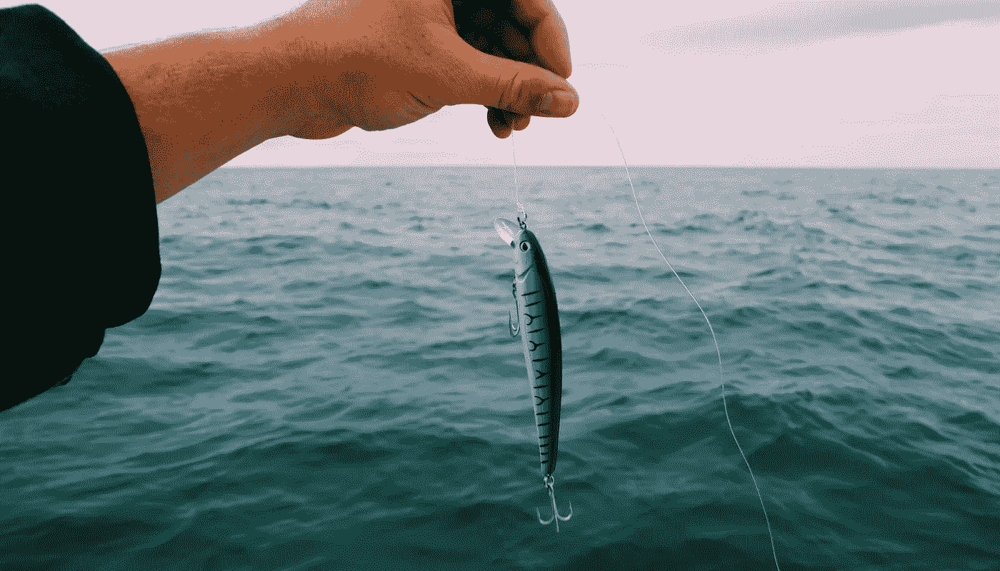

# 诱惑:亚马逊时代对本地企业的洞察

> 原文：<https://medium.com/swlh/lures-an-insight-for-local-businesses-in-the-age-of-amazon-eaeffce11f08>

Photo by [Mael BALLAND](https://unsplash.com/photos/ZWF1DVAXXLY?utm_source=unsplash&utm_medium=referral&utm_content=creditCopyText) on [Unsplash](https://unsplash.com/?utm_source=unsplash&utm_medium=referral&utm_content=creditCopyText)

已经过去几年了，但我仍然记得我的第一次诱饵秀。毫不奇怪，我会有很多渔民朋友。我住在明尼苏达州，那里有一万个湖泊。这些朋友中有几个对他们的钓鱼非常认真，尤其是鱼饵这一行。