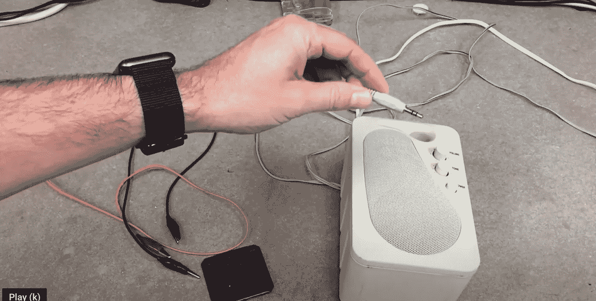

# MacGyver 第一季第 10 集科学笔记:钳子

> 原文：<https://medium.com/swlh/macgyver-season-1-episode-10-science-notes-pliers-70a62c40a389>

**提高车速。**

麦克和杰克试图在一场汽车追逐赛中逃脱(用一辆不太快的车)。当然，MacGyver 会给他们一个速度提升，但第一步是移除汽车引擎盖。MacGyver 用化学品和汽水罐制造一些小型炸药。嘣。不再有兜帽。