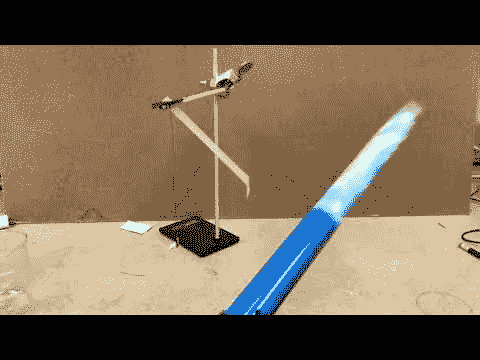

# MacGyver 第一季第 15 集科学笔记:放大镜

> 原文：<https://medium.com/swlh/macgyver-season-1-episode-15-science-notes-magnifying-glass-d4f94b77f01b>

**拿着电视电缆跳出窗外**

MacGyver 从墙上扯下一根电视电缆，绑在自己身上。然后嘣-他从二楼窗户跳出去抓坏人。当他倒下时，电缆从墙上被拉下来，这在某种程度上阻止了他与地面的全力撞击。