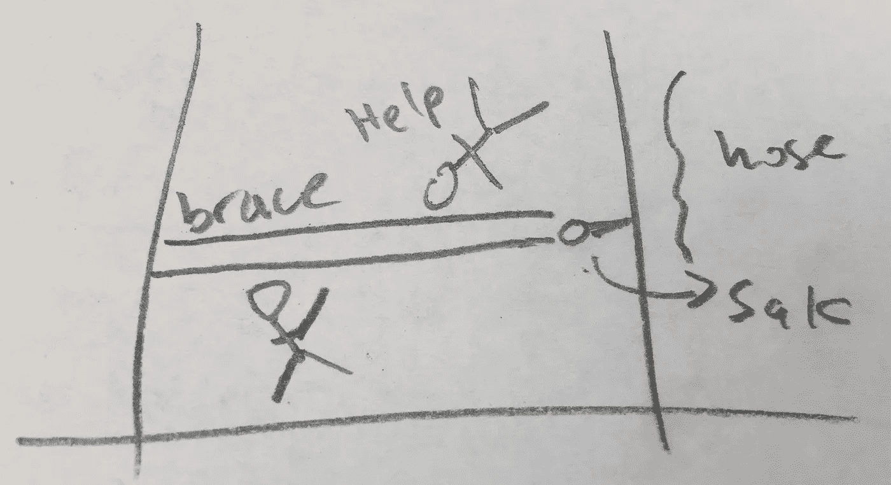

# MacGyver 第一季第 19 集科学笔记:19 指南针

> 原文：<https://medium.com/swlh/macgyver-season-1-episode-19-science-notes-19-compass-8f661673e3c4>

Photo: Rhett Allain. Initial idea for the trash compactor.

**“正常”是什么意思？**

MacGyver 和 Jack 被困在垃圾压缩机里——就像《星球大战 4》里一样(但没有垃圾怪物)。这个场景的目标是让 MacGyver 想出一个解决方案，但是 Jack 错误地解释了指令并受伤了。

所以，为了阻止垃圾压实机，麦克用他的瑞士军刀弄了一根杆子(SAK)…