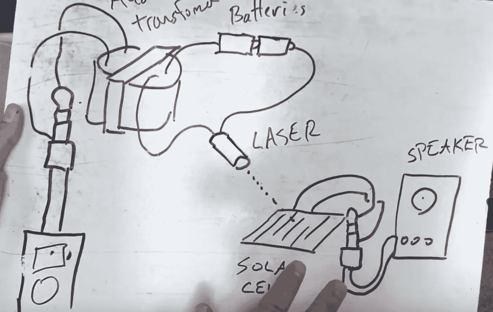

# MacGyver 第二季第 12 集科学笔记:杰克+麦克

> 原文：<https://medium.com/swlh/macgyver-season-2-episode-12-science-notes-jack-mac-f2c65ea628be>

Photo: Rhett Allain. Diagram showing the workings of a photophone.

在我开始这一集的科学之前(这里有一些很棒的 MacGyver hacks)，让我说一些关于这个节目的其他事情。这一集的故事情节很棒。它有一个很好的情节，我真的很喜欢 MacGyver 和杰克倒叙。现在来看一些科学。

**光电话**