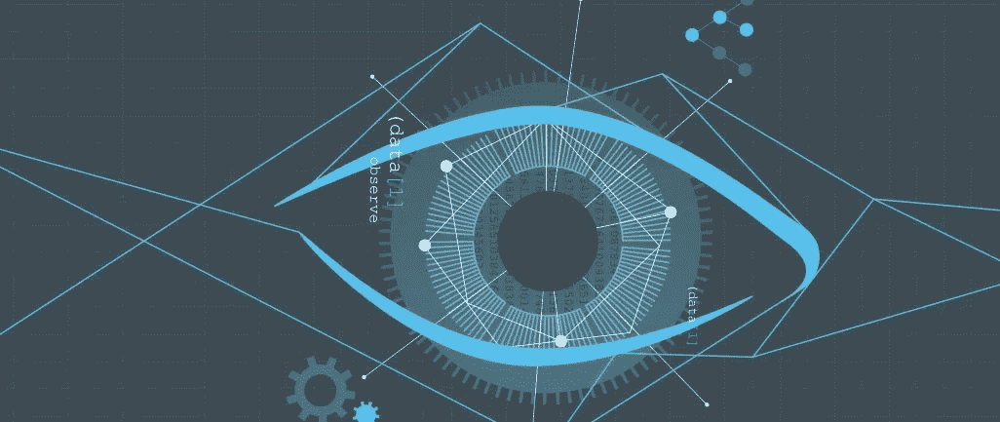

# 从机器智能到机器好奇心——机器创造力之路

> 原文：<https://medium.com/swlh/machine-intelligence-to-machine-curiosity-the-route-to-machine-creativity-c07c138e145>

Many believe that the coming of the age of Artificial Intelligence (I prefer the term Machine Intelligence) is as epochal an event as when humans learnt to make and control fire.
Up until very recently, Machine Intelligence (MI) was still in its infancy based in essence on super-fast computer-aided pattern recognition.
The most widespread use of the first generation of MI was in the banal business of targeting digital advertising using surreptitiously gathered usage. With the benefits mainly going to the likes of Google and Facebook. It is not clear whether it benefited consumers in any significant way. In fact, it is emerging that MI-driven targeting techniques have been misused to sow dissent and strife in societies and communities. Over the past few years, the second generation of MI has begun to emerge through a set of neural network techniques based on the principle of Deep Learning.
Deep Learning techniques took a giant leap forward when Jürgen Schmidhuber at the Lugano University and his student Sepp Hochreitter proposed a type of Recurrent Neural Network (RNN) architecture that they called the Long Short-Term Memory (LSTM).
With LSTM type architecture, neural networks gained one of the critical distinguishing abilities of human intelligence — the ability to learn how to learn.
The use of these new generations of artificial neural networks has been magical. Deep Blue — the IBM AI Engine that in 1997 beat Kasparov, the then reigning world champion- had to do a recursive analysis of the millions of chess games that had been fed to it every time it had to decide on a move
Cut to 2016\. Using LSTM type RNN techniques, DeepMind, a Deep Learning engine, sets out to learn Go (a strategy game considerably more complex than Chess) and Chess.
All Deep Mind was fed were the game’s rules, and the program began to learn by playing against itself.
The result? In 2016 AlphaGo, DeepMind’s Go engine, beat Lee Seedol, a high profile Go player, 4–1\. In 2017 it was pitched against Ke Jie, the world’s best player. The fight was more challenging this time, but AlphaGo won 2–0 in 3 game series.
In December 2018, AlphaZero, Deep Mind’s chess engine, obliterated Stockfish, the highest-rated “old world AI” chess engine. AlphaZero beat Stockfish in a closed-door 100-game match with 28 wins, 72 draws and no losses.
In April 2019, a 1000-game rematch was arranged. AlphaZero won 155, lost 6 and drew 839\. Moreover, in a series of time-odds matches where Stockfish was given up to 10 times more time to make its move, AlphaZero still won.
Deep Learning does not just learn to learn; it knows to learn fast and act faster.
Deep Learning is at the core of tremendous leaps in speech recognition and translation, driving real-time applications like Amazon’s Alexa, Google Assistant, Apple’s Siri, and Facebook’s billions of real-time translations of posts and messages.
Experts like Schmidhuber and Demis Hassabis, one of the founders of Deep Mind (acquired by Google in 2014), are now at work to shepherd in the next generation of MI.
Innovation and creativity are the highest level products of the human mind. The experts are now working to make AI systems that can match humans in these two areas.
DeepMind is being put to work on innovation and creating products and services that make for a better world in consumer marketing. At the heart of the juggernaut that Apple is not its advertising or selling strategy, brilliant as that may be, but innovative design.
The next generation of MI will begin to contribute to real-world innovation and creativity. In other words, the next generation will aim to add another Jonathan Ive and Steve Jobs to the Apple innovation and product design team.
Deep Learning systems have already started delivering fine-creating high-grade paintings, musical compositions, and poetry.
However, that is still not real-world innovation and creativity. Painting, music and poetry have rules and works can be created by either following or breaking the rules in innovative ways.
In the real world, there are no clear rules. Therefore, an innovation and creation system will move from supervised learning to active learning.
The first step in active learning would be deciding what to observe and study autonomously — an attribute called Curiosity! In other words, an AI system capable of generating and acting upon Machine Curiosity. The Curiosity will be directed by a higher-order goal setting than the tight purposive framing the current generation of MI operates on.
The next step would be for the MI system to act on this Curiosity.
Schmidhuber believes that a critical capability for a MI system to act on its Curiosity is to observe and act on available data and create data by poking, prodding, and experimenting with the real world.
This next generation of curiosity-driven, experiment-making MI systems will unleash the creativity of an order higher than the world has yet to see. According to the experts, we can see this next generation of MI within the next decade or two.
Will this creativity exceed that of the Clio-winning copywriter? You bet. Will it enable L’Oreal to create the genuinely age-defying, DNA-keyed skincare regimen? Probably.
Will it beat the highest level of human creativity? That question is being debated hotly. I believe that human creativity will always be a step ahead of MI creativity. A symbiotic relationship that will keep feeding into each other.
So all ye genuinely innovative and creative marketers rest easy. Tomorrow’s MI will not replace you. It will only make you more productive by goading you to better yourself.