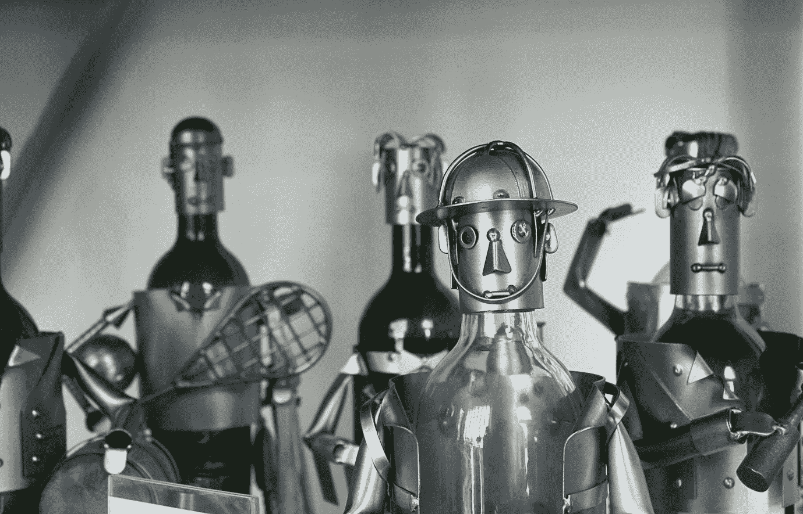

# 奶奶的机器学习。

> 原文：<https://medium.com/swlh/machine-learning-for-grandmas-265da463a648>

source unsplash.com

> 正如卡洛斯·加锡亚·莫雷诺所说:人工智能是当今的主角。以至于拥有强大处理器的全能计算机开始拥有协处理器或神经元引擎来为人工智能任务分配资源。

**来源 andro4all.com**

谈论人工智能，说得相当清楚一点就是谈论通常需要…