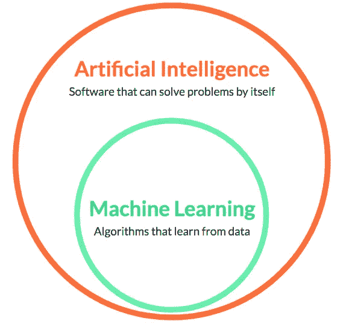
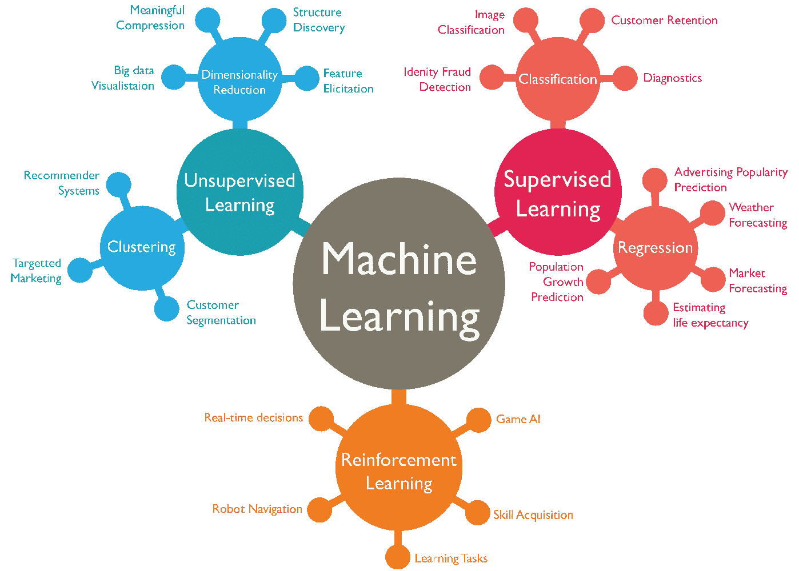
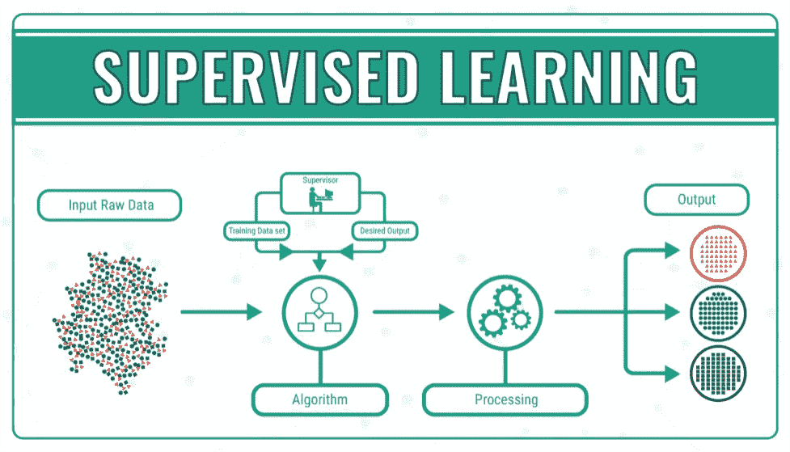
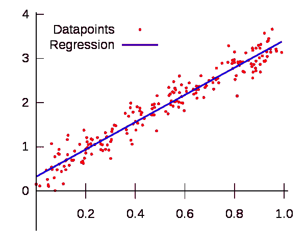
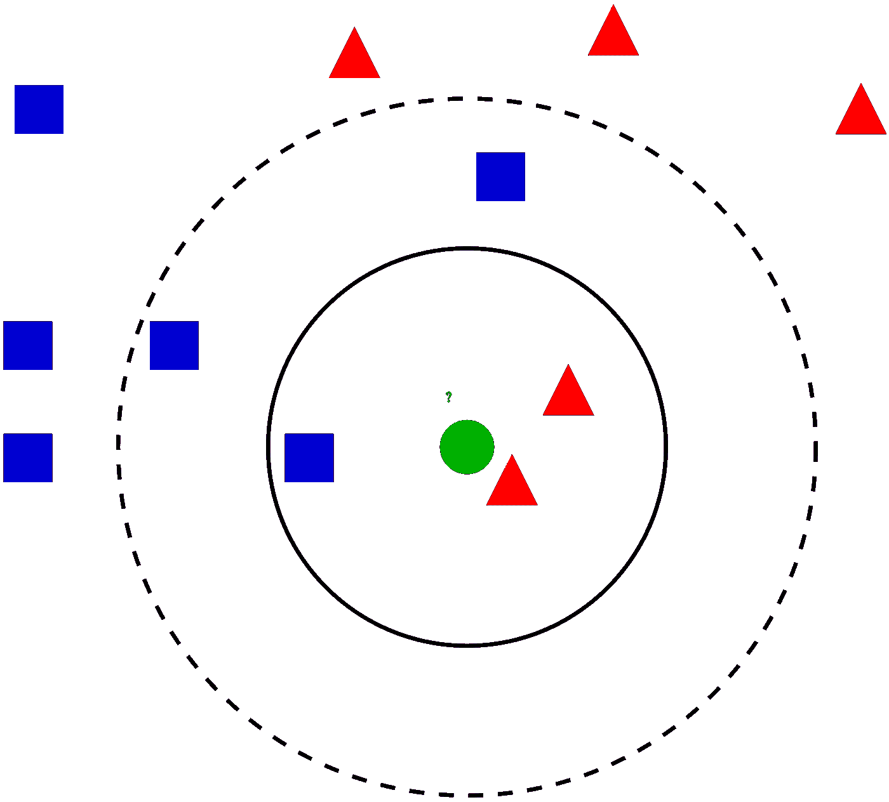
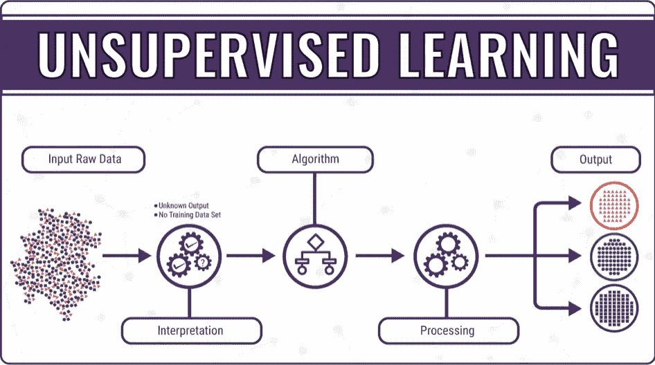
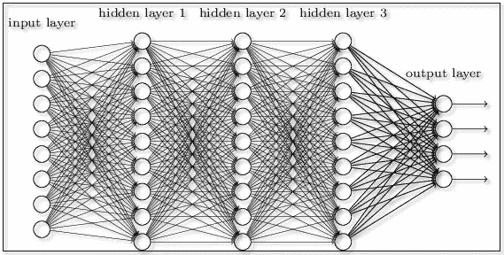

# 老奶奶的机器学习

> 原文：<https://medium.com/swlh/machine-learning-for-grannies-b1b6e6ba560d>

对想了解更多信息的人的简单介绍。

想象一下这个:

这是一个舒适的星期五晚上，你和你的奶奶正在吃晚饭。她刚刚用她美味的食物喂饱了你，现在想让你帮她修改 Skype 帐户。“这没用”她抱怨道。原来她不知何故感染了特洛伊木马病毒。您恢复了她的电脑，创建了一个新的 Skype 帐户，一切正常。

“告诉我你在学校干什么！”她问道。你知道没有办法解释事情；“嗯，计算机相关的东西”你回答。“但是什么类型的东西？”她又问道。“这叫做机器学习..?"你说，希望她能向前看。她没有。“什么是机器学习？”她热情地问道。

如果你现在正处于这种情况，不要担心！这篇文章正是为了这个目的——你如何向一个在这个领域几乎没有任何知识的人解释这样一个概念呢？好吧，你开始得慢而简单。

*(这篇文章是写给任何想学习更多机器学习的初学者的，不仅仅是老奶奶们*😅 *)*

# 什么是机器学习？

> **机器学习** ( **ML** )是对计算机系统使用的算法和统计模型的科学研究，以便在不使用明确指令的情况下有效地执行特定任务，而是依靠模式和推理。它被视为人工智能的一个子集。

简单来说，一个会学习的机器！机器学习是人工智能(AI)的一个子领域，所以我们首先必须理解这个概念。

## 人工智能

我相信你在很多不同的电影中都听过这个术语——“前玛奇纳”、“黑客帝国”、“创”等等。这个术语通常是在负面的背景下出现的，比如“机器人接管世界，变得比人类更聪明”，但实际上，这个行业根本不是这样(到目前为止)。我们每天都在我们身边看到人工智能:无人驾驶的特斯拉汽车在街上漫游，“Alexa”——亚马逊的语音识别个人家用设备，你可以从中播放音乐，以及许多其他设备。每个人都想知道网飞是怎么知道你接下来应该看什么节目/电影的？那是人工智能！它已经在很多方面影响了我们的世界，而这仅仅是个开始。

> **人工智能** (AI)是机器，尤其是计算机系统对人类**智能**过程的模拟。这些过程包括学习(获取信息和使用信息的规则)、推理(使用规则得出近似或明确的结论)和自我纠正。

这个行业在过去的几年里发展迅速，它将比近期的任何其他创新更能塑造我们的未来。

本质上，人工智能是机器执行被认为是“智能”的任务的能力，而机器学习是人工智能的一种应用，基于这样的想法，即机器应该能够处理数据并自主学习(在我们教会它如何学习之后)。

让我们更深入地挖掘机器学习，看看幕后发生了什么。

# 机器学习的类型

Real-life examples of Machine Learning Types

机器学习可以分为三个不同的类别—

*   **监督学习**
*   **无监督学习**
*   **强化学习**

这些类别是根据数据如何传递给我们试图构建的程序来划分的；有监督的，它使用基于人工定义的示例来标记数据的算法；无监督的，它不向算法提供任何标签，并且程序必须基于算法来区分数据的聚类。强化学习是一个稍微不同的概念，它结合了两者。

## 监督学习

这种机器学习的方法是最流行的，也是最容易理解的。如前所述，通过监督学习，我们向机器提供一组标签(示例),用于处理新输入并给出所需输出。

例如，让我们以一个我们都知道的过程为例——存放支票。当然，我们是在 21 世纪，没有必要开车去银行；所需要的只是我们手机上的支票图像，瞧，钱已经存入你的账户了。在这种情况下，受监督的机器学习算法必须处理支票上的笔迹，将它们转换为数字，然后完成预期的任务。

机器如何处理手写数字和字母？嗯，该算法首先接收数千张手写字符的图片，以及人们为每个字符制作的标签。找到了字符和标签之间的关系(根据算法而变化)，现在程序可以使用相同的关系对新图像进行分类。通过监督学习，我们教会机器找到现有数据的特定模式，然后它可以使用识别新数据。这种方法的一个明显缺点是需要大量数据来创建学习算法。对于手写字符，一个人需要标记数以千计的不同图像，这需要一些工作。

监督学习可以分为两个子群:**回归**和**分类**。

## 回归

回归实际上来源于统计学——这是一种当目标量连续时预测所需目标量的值的技术。从本质上讲，回归模型可以根据相似事物的值找到某个事物的值。

例如，我们想预测某人的年收入是多少。我们接受这个人的所有重要信息:受教育年限、年龄、地点以及其他任何相关信息；这些属性被称为 ***特征、*** ，并且根据其类别可以有不同的值(数值、二进制—“是”/“否”)。

监督学习是基于已知的数据，所以我们首先需要输入许多不同的人，他们的特征和年收入；*“大卫受过 3 年教育，今年 24 岁，住在纽约州。他的年收入是 12 万英镑。*有了更多这些特征，回归模型将在这些特征和年收入之间建立关系。

一旦发现一个模式(如上图所示)，我们就能够根据模型发现的模式预测新人的收入。相当整洁。这听起来相对简单和容易，但更困难的部分是计算目标值和特性之间的关系。为此，我们有一些著名的监督学习算法:线性回归、多项式回归、支持向量回归、决策树回归等等。

## 分类

分类模型并不试图预测一个值，而是试图从观察值中得出一些结论。他们预测一个*标签*；"这是不是垃圾邮件？"，“用户会点击这个广告吗？”。为了预测一封电子邮件是否属于“垃圾邮件”类别，它必须首先找到其他垃圾邮件的模式。

这些模型永远不可能 100%准确，因为机器不能像我们的大脑一样做出决定。这完全取决于分类模型，以及使用哪些特征来对组进行分类。例如，如果我们试图建立一个模型来识别一个动物是否是爬行动物，我们必须决定哪些特征使一个动物成为爬行动物。假设我们用*“冷血？”*，和*“下蛋？”*；如果我们的输入数据满足这两个特征，我们可以将其归类为爬行动物。鳄鱼？作品。蜥蜴？没错。三文鱼？等等……鲑鱼是冷血动物，会产卵，但不是爬行动物。我们的分类模型产生了假阳性。在这种情况下，我们将增加模型的功能，使其更加准确。

不同的模型对假阳性/假阴性有或多或少的影响。在癌症发现模型的情况下，我们需要最少的假阴性。我们宁愿我们的模块产生一个正值，并通过进一步检查发现它实际上是负值。

我们有几个不同的模块用于分类，每个模块都取决于我们想要预测的数据类型。

## KNN-K-最近邻

让我们稍微深入一下众多**监督学习**算法中的一个。这是最简单的一个，有些人甚至不认为它是机器学习，因为它很简单。这个想法非常基本——根据数据点的 *k* 最近邻的类别来标记数据点。该算法可用于回归或分类模型，尽管它主要用于分类。

在这个例子中，输入是一个绿色的圆圈——我们需要将其归类为两个现有类别之一，蓝色正方形或红色三角形。我们不是计算现有数据的复杂关系和分析新输入的特征，而是简单地查看最接近的项目。

对于 *k=3* (即在最近的 3 个邻居中)，我们找到两个红色三角形和一个蓝色正方形。在这种情况下，我们会预测神秘的绿色圆圈是一个红色三角形，因为它们是他最近的邻居。如果我们使用 *k=5，*我们会发现 3 个蓝色正方形和 2 个红色三角形，因此我们将绿色圆圈标记为最常见的蓝色正方形。这就是 k 近邻背后的全部思想。

决定什么是 k 会改变输出。这个因素对算法的误差有很大的影响，因为我们不想过度适应新的输入，也不想过度估计。

该算法的步骤如下:

*   加载现有数据。根据不同的特征创建一些划分点的图形。
*   根据我们现有的数据，为 k 选择一个值。
*   找到新数据点的周围 *k* 个邻居的最频繁类。

大多数情况下，数据在 2D 图上无法如此容易地划分，我们必须找到一些其他方法来计算新数据点与所有现有数据点之间的距离。例如，如果我们试图预测一所房子的价格，不同的因素不能被绘制在图上，我们需要找到不同的方法；其中包括 [**欧几里德**或**曼哈顿距离**](https://dataaspirant.com/2015/04/11/five-most-popular-similarity-measures-implementation-in-python/) **。**

# 无监督学习

在某些情况下，我们一开始就没有基于用户的数据。如果一个新产品问世，我们需要对它进行预测，没有任何数据，我们就没有办法分析过去的信息。我们把这些情况称为 ***无监督*** (因为数据是 ***无标签*** )学习，其中模型学习如何找到一个数据集的底层结构。在无监督学习中有一些常见的任务，最常见的是通过相似性将数据"*聚类成组。*

**

*无监督学习更容易出现错误预测，因为我们不知道输出应该是什么。*

*有各种聚类方法— k-means 聚类、层次聚类和其他几种方法。检查 [***这个***](/machine-learning-for-humans/unsupervised-learning-f45587588294) 如果你想了解更多关于无监督学习。*

## *强化学习*

*我们不会过多地扩展这个话题，因为它在机器学习中不太受欢迎。强化学习是一种通过试错进行学习的计算方法——从行动中学习。*

*想想人类是如何通过与环境的互动来学习事物的。例如，我们看到一个壁炉，它看起来很漂亮。我们靠得更近，这让我们感到温暖——这是一种积极的体验。我们稍微靠近一点，它就燃烧起来——一种负面的体验。我们知道从远处看火感觉很好。这种交互系统在强化学习中实现，目标是长期回报最大化。*

*一个机器的例子是一个试图行走的机器人。它迈出了第一步，但却跌倒了。这成为我们强化学习计划中的第一个数据点。由于结果是否定的，系统试图调整自己以产生一个肯定的结果，例如迈出一小步。*

*强化学习有不同的方法，如马尔可夫决策过程(MDP)、Q 学习、策略学习等等。*

# *神经网络和深度学习*

*机器学习包含了一个最近比较热门的子领域——***深度学习*** 。这项技术试图教会计算机做人类自然会做的事情，通过实例学习。最近它得到了很多关注，这是有原因的；以前不可能的事情已经实现了。*

*深度学习模型学习如何直接从图像、文本、声音或其他形式的输入中对任务进行分类。构建良好的模型可以实现极高的准确性，有时甚至超过人类水平的性能。*

*神经网络是一套通常用于深度学习的算法，它们试图通过多层识别数据中的模式来实现人脑的过程。它们通常被称为'*深度神经网络*'，因为深度学习数据在产生任何输出之前可以通过多达 150 个隐藏层。*

**

*looks terrifying.*

*这是非常基础的介绍；如果你想了解更多，了解这一切与人类大脑的关系，我推荐从这里开始****。*****

# **概括起来**

**当机器人变得比我们聪明并接管世界时，至少你会知道为什么！机器学习是一个非常广泛的概念，包含更多的子概念，是一个更广泛的概念(AI)的一部分；在本文中，我们简要回顾了机器学习的基础知识，如果您觉得有趣，我建议您深入研究:**

*   **[机器学习算法和实现](/free-code-camp/the-hitchhikers-guide-to-machine-learning-algorithms-in-python-bfad66adb378)**
*   **如果你准备好进入编程，请查看一下[***tensor flow***](https://www.tensorflow.org/tutorials)*—一个用于研究和生产的开源机器学习库***
*   ***谷歌的一个很棒的机器学习程序— [**quickdraw**](https://quickdraw.withgoogle.com/)***

***如果你觉得这篇文章有帮助或者有一些改进的建议，请随时联系 [**twitter**](https://twitter.com/eitanmayer57) ！***

# ***来源***

*   ***[https://link.medium.com/ELQ0VrYZYX](https://link.medium.com/ELQ0VrYZYX)***
*   ***[https://skymind.ai/wiki/neural-network](https://skymind.ai/wiki/neural-network)***
*   ***https://www . quora . com/What-is-regression-in-machine-learning***