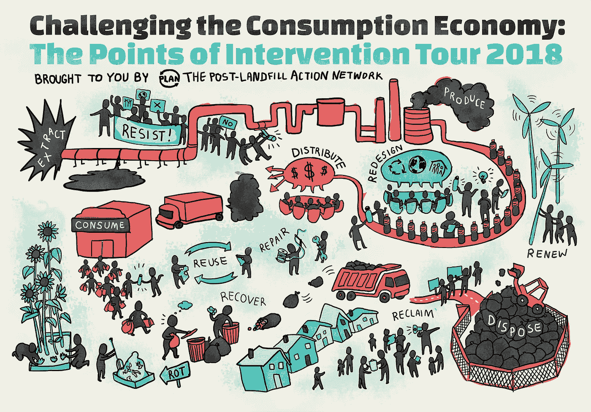

# 机器学习素养:干预点

> 原文：<https://medium.com/swlh/machine-learning-literacy-points-of-intervention-665ed9a63c98>

My primary metaphor comes from PLAN: the Post-Landfill Action Network. They show different points of intervention that ALL need to happen in the environmental cause. Each one has it’s part. From shutting down incinerators to re-using clothing. To blocking landfills to repairing someone’s socks. Resisting has its place, rebuilding has its place, healing has it’s place, policy has its place. There are several ways of making change and we all need to find our place.

我以前说过，现在我要再说一遍，**让我们在人机界面**中展开这场戏剧。我这么说是什么意思？我的意思是认识到我们创造的新奇有趣的工具需要成为旁注；不是主要的吸引力。我的意思是认识到数字素养、对健康或安全技术的依赖、隐私问题和数字操纵可能是*生死关头*。有时这意味着真正的死亡；比如…