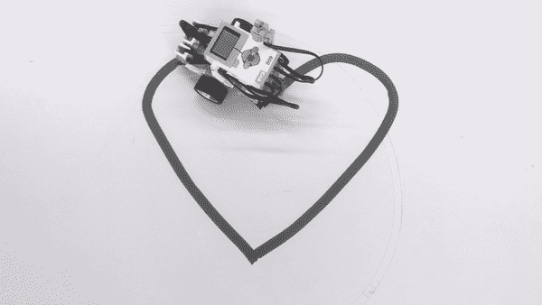

# 乐高头脑风暴 EV3 机器学习

> 原文：<https://medium.com/swlh/machine-learning-on-lego-mindstorms-ev3-2384004702f9>

作为我硕士论文的一部分，我开发了一个工作流程和练习，将机器学习(ML)引入乐高思维风暴 EV3 公司。为了给你一点关于我论文的背景，我的目的是创建一个教育编程环境，用乐高思维风暴向高中生教授机器学习算法。找到一个合适的任务来教孩子(或者更确切地说是青少年)最大似然算法并不容易…