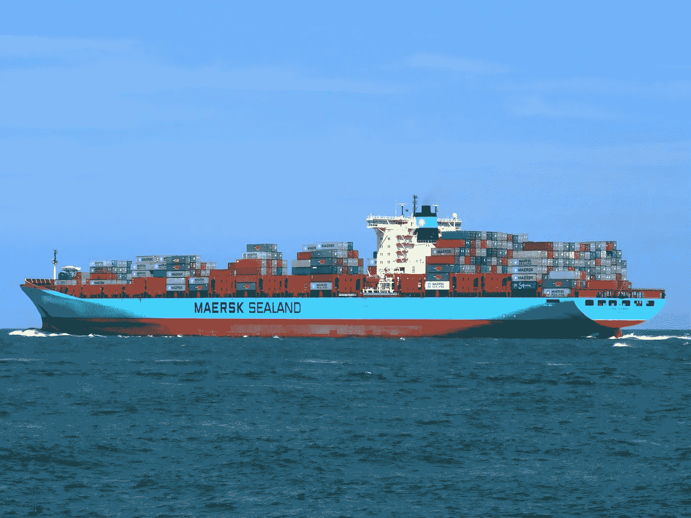

# 马士基:不再是你父母的船运公司了！

> 原文：<https://medium.com/swlh/maersk-not-your-parents-shipping-company-anymore-93490d1ae73d>

2018 年 9 月 19 日，马士基宣布对其业务部门进行重组，包括将全球第 18 大货运代理公司 DAMCO 的一部分并入马士基的核心班轮业务，以创建一家“端到端”的供应链服务公司。

这一宣布并不是重组的真正开始，而是这家全球最大轮船公司多年战略转变的结束。让我们来看看马士基的策略的含义:

**举措:**自 2016 年以来，马士基已出售其马士基石油业务，并剥离其钻井业务。

**目标:**尽管这些交易让一些行业专家开始问“APMM 还剩下什么？(马士基的母公司)”，简单的事实是马士基专注于变得更精简。

**举措:【2018 年 1 月，马士基承诺与 IBM 成立一家合资公司，建立一个基于区块链的贸易服务平台，最近命名为 TradeLens。**

**目标:**马士基清楚地看到了机会*并需要*成为国际贸易、供应链和物流数字化的领导者。此外，他们意识到，像 IBM 这样的真正的技术巨头必须*在流程中与他们并肩作战，以确保成功执行。*

**此举:**2018 年 2 月，马士基宣布有意成为“集装箱物流的全球整合者”

**目标:**Maersk 的目标是比以往任何时候都更加深入物流流程，以实现未来的增长和盈利。目前还不完全清楚的是，它们是否会像 UPS 或联邦快递那样成为基于资产和服务的集成商，或者是使用 TradeLens 的技术集成商。

**此举:**作为 9 月 19 日重组公告的一部分，马士基还宣布了将旗下几个班轮品牌合并成一个运营架构的计划。

**目标:**马士基通过提高核心班轮业务的组织效率来保护“特许经营权”。

那么，现在马士基精简、吝啬，并准备部署一个尖端技术平台，增长故事是什么？抛开班轮业务，让我们来看看物流和供应链集成商的方法及其可能产生的结果:

1.  马士基作为基于资产的整合者的想法没有给人留下深刻印象。它既不创新也不赚钱。经济学讲不通。像 UPS 和 FedEx 这样的集成商将航空货运、零担货运、供应链解决方案、贸易融资和保险业务作为独立的利润中心来运营，为客户和竞争对手提供端到端或“按菜单点菜”的物流服务。但是对他们来说，最赚钱的是次日空中文件和包裹业务。根据物理定律，集装箱运输无法提供那种额外的加急服务。毕竟，集装箱船上没有可以追加销售的商务舱座位。
2.  然而，具有巨大潜力的整合机会是“马士基平台”业务。平台企业利用第三方为客户和平台所有者创造更多价值。需要一个大公司发展平台业务的成功例子？让我们看看[苹果](https://www.coloadx.com/blog/apple-amazon-trillion-dollar-logistics-showdown)，更具体地说是 iPhone。iPhone 是苹果的专有设备，iOS 是为其提供动力的软件，但正是第三方应用程序开发者社区使该平台更有价值，并通过 AppStore 为苹果创造分销收入。马士基的策略是将班轮业务作为核心产品，将 TradeLens 区块链解决方案作为操作系统，将货运代理、物流技术公司、卡车司机、报关行等作为核心产品。“应用开发者”的世界

在这个阶段，如果已经有了一个成功平台的蓝图，为什么还要考虑基于资产的集成商模型呢？

首先，让我们记住，这是一家进入未知水域的大公司，这个行业不是为快速或剧烈的变化而建立的。所以马士基需要对冲。如果行业不接受它的平台是中立和互利的，那么这个策略就失败了。到那时，马士基将不得不退回到传统的重组方式，DAMCO 可能会被出售给另一家全球货运代理公司(正如目前的猜测)，而一家拥有精简班轮业务的精简公司可能会继续取得成功。物流行业分析师 Alessandro Pasetti 在 2018 年 9 月 26 日发表在 *The Loadstar* 的一篇文章中，甚至暗示马士基“可能正在关注与 DSV 的一笔更大的交易……两家公司最终会合并，”他指的是全球货运巨头 DSV。

其次，所有平台都带有“原生应用”，以确保基本的功能水平。继续苹果的例子，iPhone 本身取得了巨大的成功，甚至在第三方应用出现之前就扰乱了手机市场。为什么？因为它提供了预装浏览器、电子邮件客户端、短信和其他功能，而没有等待 Chrome、Gmail 或微信被发明出来或 iOS 就绪。这就是斜纹进入画面的地方。

作为 DAMCO 进军数字货运代理的尝试，现在看来很明显，Twill 是一家科技初创公司，可以与 DAMCO 的规模相媲美。直接的结果是，TradeLens 至少拥有一家承运商和一家货运代理、一家贸易融资银行以及几家活跃的供应商和次级供应商(一家集成商),以便在其他参与者加入时为其用户提供即时利益。

**那么，这一切对您的企业意味着什么？**

*   **货运代理**:你安全了。在最近接受 JoC.com 采访时，马士基航运公司首席执行官卡斯滕·金达尔表示，“我们无意向三分之一的客户宣战。”事实上，在平台商业模式下，你将为马士基的未来增添前所未有的价值。此外，你可能最终会拥有一批科技产品，以应对[电子商务](https://www.coloadx.com/blog/is-amazon-finally-set-to-conquer-freight)公司在增加物流业务时将面临的挑战。
*   NVOCC 的:这是一个艰难的处境。很明显，有人将建立一种更好的买卖全集装箱运输能力的方式，并把它变成某种现货市场。它很可能是马士基，因为一个到达海洋货运代理的平台几乎肯定会有现货市场功能。FCL 销售的日子，尤其是对中立的 NVOCC 来说，可能即将结束(LCL 可能也不远了)，除非他们加入一个专注于为他们的企业提供同样好处的中立平台。
*   **托运人/货主**:一个包括你最好的服务提供商，并且不强迫你使用平台所有者的产品的平台，是你过去 60 年左右一直梦想的发展。
*   携带者:打败他们或加入他们。如果马士基的平台方法可以满足对 T2 中立性的担忧，那么较小的航空公司几乎肯定会加入进来，以提高他们在运力营销和生产率增长方面的效率。但对其他人来说，这是建立竞争平台的机会。为什么？一旦一个平台成功了，它也可以提升它的竞争对手或者创造新的机会。以科技为例，苹果是创新者，并继续从 iPhone 生态系统中获得巨大回报。但它们是最大的移动平台业务吗？不，这个区别属于谷歌 Android。你有多经常成为第二名，最后成为[谷歌](https://www.coloadx.com/blog/ok-google-welcome-to-logistics)？

发生了！

对于过去几年物流领域的所有创业行动，以及对一个缓慢采用技术的关系驱动型企业的自动化能力的所有怀疑，马士基的举动证明了一件事:一个转折点即将到来。话题已经从“如果”业务可以自动化转移到“什么时候”可以自动化，这为行业带来了巨大的机会。

这也增加了中断的风险，因为简单地让货运业务上线现在是不可避免的。但这也是一家公司能够而且必须完成的最低要求。
然而，不变的是，在物流流程自动化的竞赛中，会有赢家和输家。让我们确保你是胜利的一方。

*福阿德·沙里夫是*[*colo adx*](http://www.coloadx.com/)*的联合创始人&兼首席执行官，这是一个为海洋货运代理和 NVOCC 提供服务的在线平台。*

*原载于*[*https://www.coloadx.com*](https://www.coloadx.com/blog/maersk-shipping-freight-forwarder)