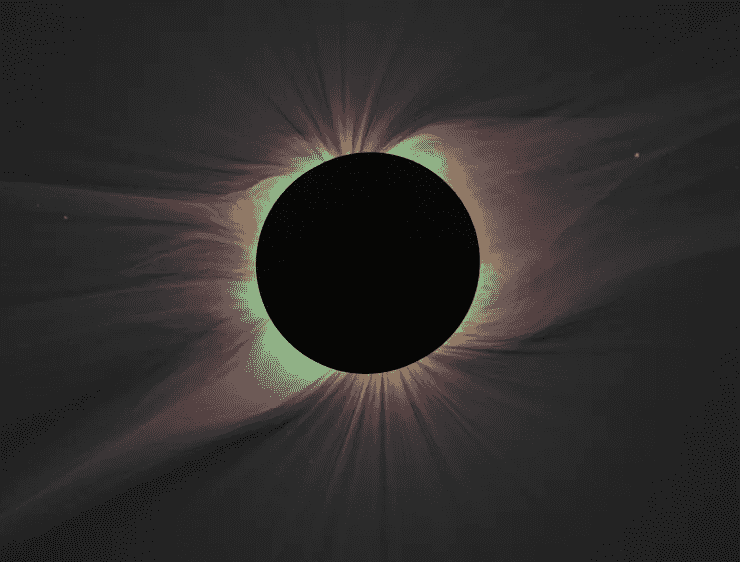

# 太阳等离子体中的磁波可能是太阳之谜的来源

> 原文：<https://medium.com/swlh/magnetic-waves-in-suns-atmospheric-plasma-might-be-source-of-solar-mystery-1ebbde48cf51>

## 好消息是我们有一艘飞船直奔那里

This image of the solar corona contains a color overlay of the emission from highly ionized iron lines and white light taken of a 2008 eclipse. Red indicates iron line Fe XI 789.2 nm, blue represents iron line Fe XIII 1074.7 nm, and green shows iron line Fe XIV 530.3 nm. **Credit:** Habbal, et al.

在 19 世纪中期，德国科学家发现了如何使用光谱学将一束光分成它的组成波长——就像棱镜一样。发现隐藏在新揭示的光频率中的是原子元素的暗示。不同尺寸的…