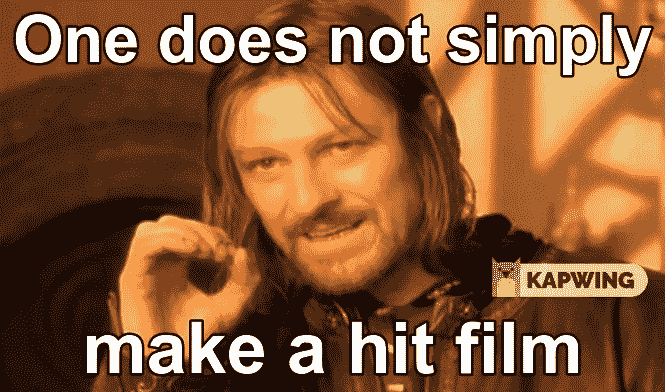

# 让电影成为迷因

> 原文：<https://medium.com/swlh/make-movies-memeable-18fdc508e9be>

# 为什么互联网要为票房缺乏原创性负责

2019 年 5 月 4 日， [*《复仇者联盟 4：终局之战》*在全球影院首映仅 11 天后就成为有史以来票房第二高的电影](https://variety.com/2019/film/news/avengers-endgame-2-billion-record-time-1203205293/)。当然，实际上，为了达到如此疯狂的成功水平,*残局*花费了比仅仅 11 天*更多的时间。事实上，这是……的顶峰*