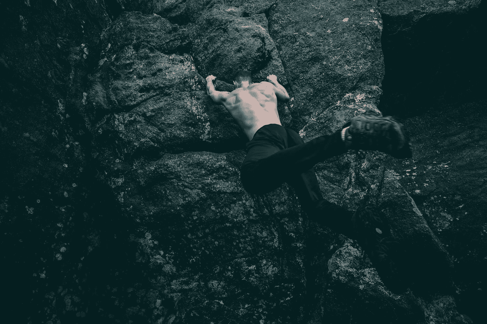

# 攀登——不带绳子

> 原文：<https://medium.com/swlh/make-the-climb-without-the-rope-249dce32f35e>

Photo by [Kal Visuals](https://unsplash.com/@kalvisuals?utm_source=medium&utm_medium=referral) on [Unsplash](https://unsplash.com?utm_source=medium&utm_medium=referral)

你可能听说过纪录片《自由独唱》的反响。这是一个关于亚历克斯·洪诺德在没有任何安全带的情况下攀登埃尔卡皮坦山的可怕而令人敬畏的故事。我完全被这个概念迷住了。人类有这样一种适应压力的能力，并在最需要的时候表现出令人难以置信的表现。