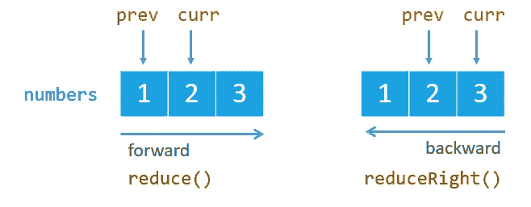

# 利用 Reduce

> 原文：<https://medium.com/swlh/make-use-of-reduce-7e123e59ddff>

Source: [http://www.javascripttutorial.net](http://www.javascripttutorial.net/)

让我们从最重要的问题开始，为什么？为什么要使用 reduce 呢？简单来说，它允许从一种数据类型到另一种数据类型的转换。我这么说是什么意思？

这是每个人一直使用的 reduce 的标准例子

`[1, 2, 3, 4, 5].reduce((acc, curr) => acc + curr) // result is 15`

让我们思考一下这个问题。我们有一个整数数组，在减少…