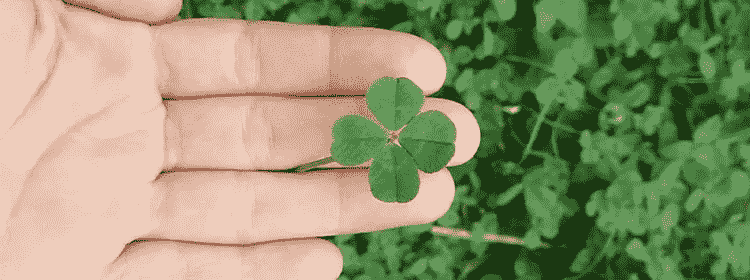

# 创造你自己的运气(和五个关键)

> 原文：<https://medium.com/swlh/make-your-own-luck-and-five-keys-to-doing-it-b06a20270135>

这是否意味着我创造了一个四叶草、马蹄铁和兔子脚的收藏？几乎没有。这种说法背后没有一点迷信，我也不会花时间在街上寻找幸运便士。相反，“创造你自己的运气”这句话唤起了一种根深蒂固的信念。运气是制造出来的，是创造出来的，不是偶然的，也不是任意的。