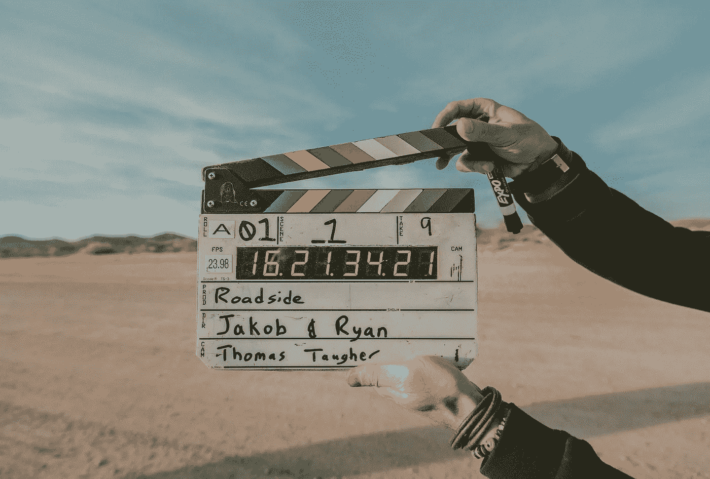

# 制作图书预告片 101

> 原文：<https://medium.com/swlh/making-a-book-trailer-101-af72696151fe>

## 如何创建这个多用途的图书推广工具

书籍预告片可以是你的书的一个很好的引子，而且通常是一个保质期很长的促销工具，你可以一次又一次地用于多种目的的促销。

视频观看量持续上升。大约每分钟有 300 多个小时的视频被上传到 YouTube 上，并且有 50 亿个视频被观看…