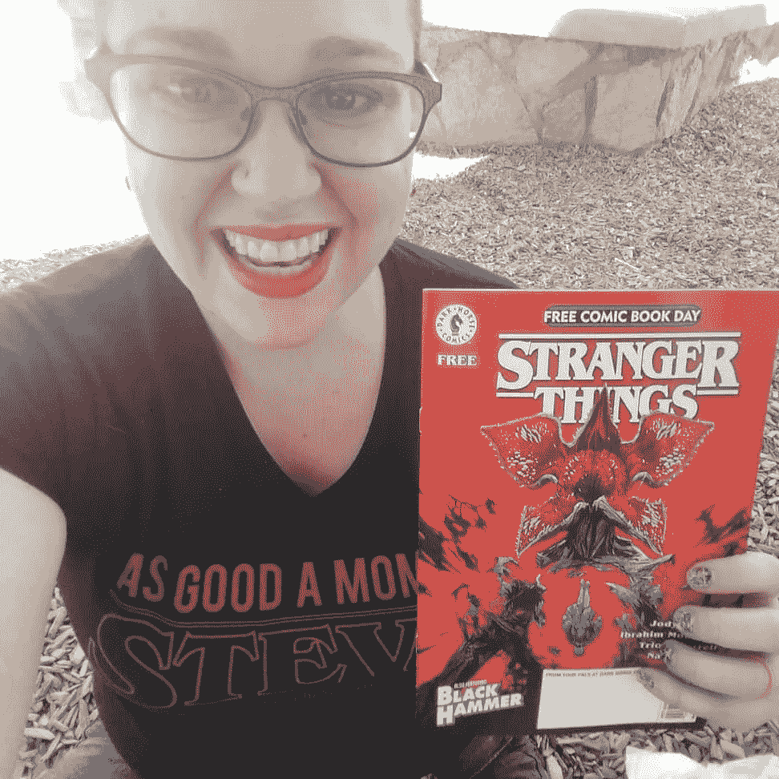
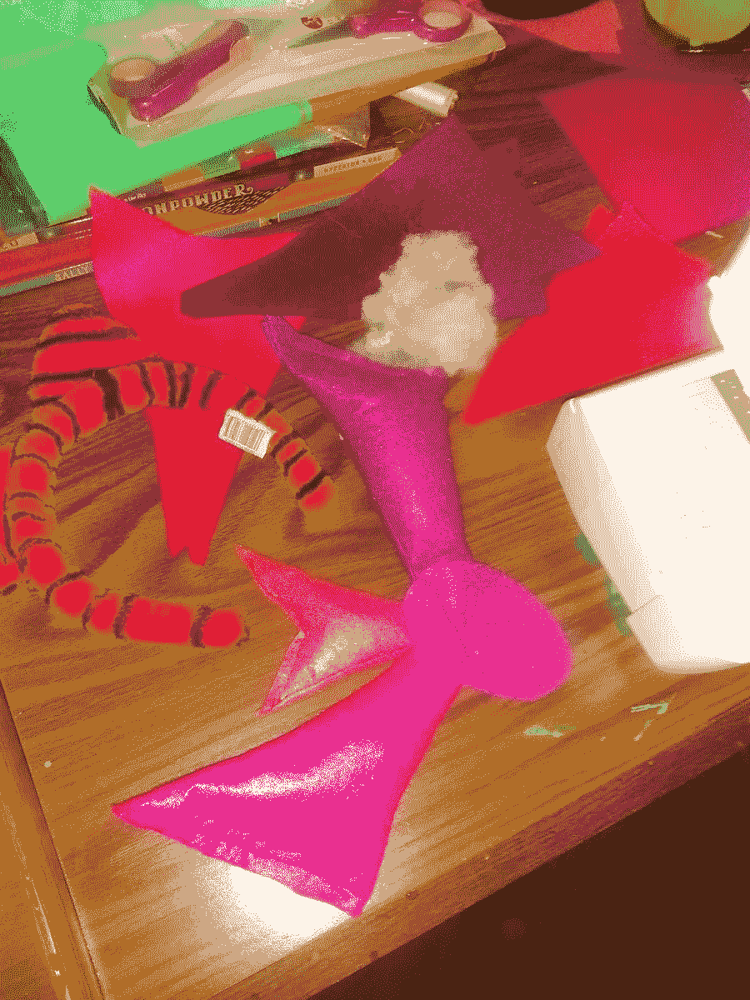

# 给漫画店建一个避难所

> 原文：<https://medium.com/swlh/making-a-sanctuary-of-the-comic-book-store-d1833a92b7f9>

我漫长的漫画阅读之路是如何与成为一个坚强、有创造力的小女孩的母亲并行的。

从童年开始，我就阅读各种类型的书籍，阅读我在图书馆能找到的任何书籍，或者每次我们去旧货店时我妈妈给我的四分之一书籍的美元。是的，在我所有的阅读中——在学校里，在车里，在我用手电筒盖着的被子里——有一个我没有想到的体裁是漫画。

这并不是说我从来不看漫画。我每天看报纸上的连环画，在我祖母家，我会读我妈妈以前的*花生*和*阿奇*。我记得我有几卷*狐步舞*和*卡尔文和霍布斯*。所以，我喜欢漫画这种媒介。我所指的是那些超级英雄和传奇人物的集合，他们定义了当今如此多的流行文化；我们说漫画时首先想到的那些东西——蝙蝠侠、美国队长、蜘蛛侠之类的。我喜欢看他们的电影，记得我和我父亲也是这么做的，但我不记得在我年轻的时候曾经拿起这些书中心爱的角色之一。

首先，我不相信我知道从哪里得到它们。那时，你在图书馆找不到一本漫画。虽然我有一个我认识的叔叔一直喜欢 DC 漫画，但我不记得有朋友给我看过或推荐过漫画。我喜欢看 90 年代的动画系列*蝙蝠侠*和 *X 战警*卡通片，但也许我的朋友们读过真正的漫画，要么是自己保留着，要么是不想与他们的女性朋友分享的男孩。

然后发生了一些事情，把我引入了粉丝世界，我终于能够在超级英雄世界里看到自己:*吸血鬼猎人巴菲。*

整个高中期间，如果我在工作或参加课外活动，我妈妈会在空白磁带上为我录制这一集，因为这是在 TiVo 或流媒体服务之前。当我去上大学的时候，第二天我们会在电话里聊起这一集，我们对吸血鬼的共同热爱提醒我给我妈妈打电话。严格来说，我的第一次角色扮演是我爸爸给我刻了一个木桩和一个十字架，当我穿着人造革裤子去化妆舞会时，我可以拿着它。

当这部剧结束时，我拿起了接下来发生的事情的小说，我对剧情有点失望(这从一个如此喜欢这部剧的人那里说了很多，我甚至不介意莱利弧)。后来我在网上听说这些漫画不错，所以我想看看。

那时我已经成年了，我的丈夫(或者当时的未婚妻，我记不清具体是什么时候了)带我第一次去了一家漫画和游戏商店。他需要 RPG 的东西，我想尝试一些漫画。我对雇员的询问遭到了嘲笑。男人们惊讶地看着一个女人出现在他们的避难所里，还有一个不帮忙的雇员，带着他们不安的目光，我什么也没买就离开了。他们的态度很明确——这只是一个喜欢巴菲的小妞，而不是真正的漫画读者。

因此，我继续阅读科幻小说和幻想小说，沉迷于 Pern 系列的*龙骑士，并开始与丈夫一起玩 Warcraf* t 的*世界。然后我开始教高中英语，同事和学生们都渴望告诉我他们的爱好，并了解我的想法。另一位老师鼓励我读《守望者》( T6 )( T7 ),并分享了一个幻灯片，他把斯皮格曼的《毛斯》( T8 )( Maus )( T9)编入了十年级关于二战文学的单元。漫画小说开始出现在我的书架上。*

作为一名儿童文学的研究生，我有机会深入研究广泛的漫画和插图文本，并对它们进行批判性思考*。图书馆开始出售漫画简编，我决定再去漫画书店试试。MCU 已经启动，就像我在看电影之前看小说一样，我想在页面上看到我心爱的 MCU 角色的发展。漫画现在是我阅读材料的一部分。*

我女儿三岁时，我带她去当地一家商店参加免费漫画书日。她听到自己要去哪里，急忙穿上蜘蛛侠的服装。当这位女士和她的女儿拿起免费漫画浏览商店时，没有人瞪我，事实上她是那天的宠儿——称赞其他购物者的粉丝 t 恤并炫耀她的服装。一名员工帮我们找到了所有年代的蜘蛛侠漫画。四年后，她独自阅读这些漫画，完全沉浸在粉丝中。我向她解释了她的第一次动漫展，漫画插画师会在那里，她拿起她的画册说，“我想知道他们是否想看我的漫画。”她不想要签名，她想要一份工作。她最近赢得了一场 cosplay 比赛，自豪地向评委们展示了她如何在《我的惊奇队长》中扮演 Goose(或 Chewie，她无法决定)时，为她的 Flerken 跨维度触角缝上毛毡。

第一次负面经历十年后，我会花一个周六去当地的漫画店为一篇文章做研究。我们是一家人一起去的，我的一个孩子抢购了漫画，我的大女儿得到了她第一对骰子，和她爸爸一起玩 RPG 游戏，我花了大约 30 分钟就*惊奇队长*的优点进行了友好的辩论，我表现得很好，以至于另一个家伙在他购物时插话说，“伙计，她是对的。”对我的女儿来说，这些当地拥有的企业是一个充满乐趣和魔力的地方，当她学习阅读时，漫画是她主要的兴趣之一。她的经历与我的如此不同，这让我非常高兴。

随着我慢慢获得称自己为漫画迷的权利，我看着她画自己的艺术作品，深夜阅读，并帮助缝制自己的角色扮演——她的创造力来自这个充满幻想和英雄的世界中的积极体验。看门人当然仍然存在，但作为一名教育工作者、作家和读者，我很高兴看到漫画艺术走向主流，有了更多样的选择和一个受欢迎的社区。我个人为此感谢 MCU。尽管在处理女性故事线方面存在缺陷，但在我结婚的 11 年里，MCU 电影一直是我和我丈夫约会和谈话的来源，在我的职业和个人旅程中给了我一个观看的机会。

对于我的女儿来说，她是否应该看漫画或者她是否属于这个世界是毫无疑问的。当我看着惊奇队长在*残局*史诗般的战斗的最后时刻被女性英雄包围时，我很感动地想着和我的小家伙一起阅读这些漫画，以及这些幻想和美丽的故事艺术是如何影响我这个作家和母亲的。我的女儿和卡罗尔都毫无歉意地来了，我很高兴我在这里。

梅雷迪思·弗洛里是一名自由作家、在家上学的母亲和军嫂，拥有堪萨斯州立大学儿童文学硕士学位。你可以在 [*【脸书】*](http://www.facebook.com/merediththemom)*[*推特*](http://www.twitter.com/meredithflory)*[*insta gram*](http://www.instagram.com/merediththemom)*关注她。阅读她过去的文章，在她的* [*网站*](http://www.meredithflory.com) *了解更多。***