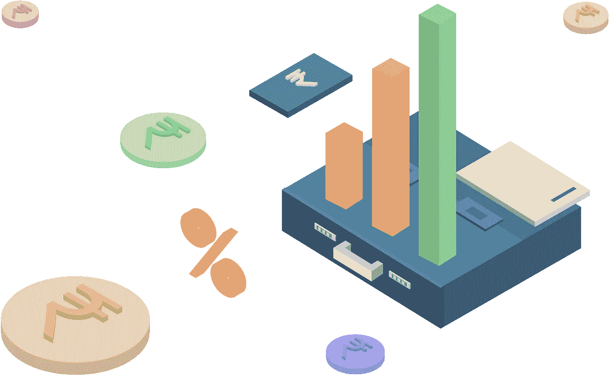
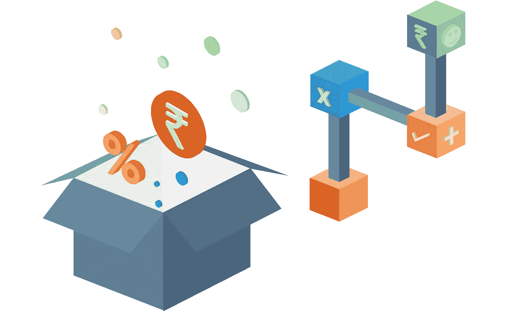
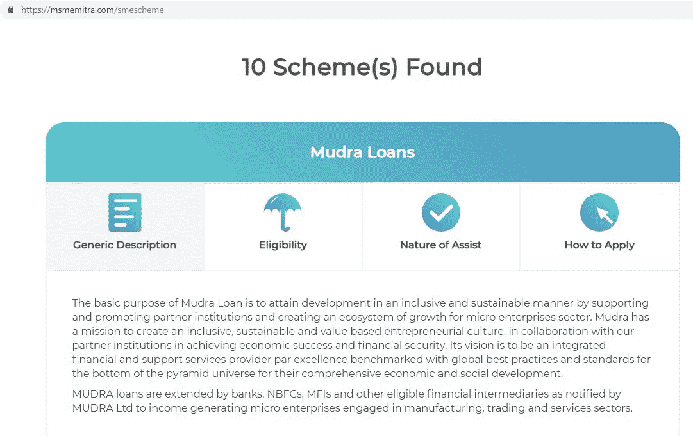

# 利用技术让印度的初创企业和中小微企业更容易获得融资和政府计划

> 原文：<https://medium.com/swlh/making-business-financing-governments-schemes-more-accessible-for-start-ups-msmes-in-india-105f781f5faa>

[MSMEmitra](https://msmemitra.com/) 正在利用技术和数字营销的力量，让印度各地的企业家更容易获得商业贷款、资金、政府推动的中小企业计划和创业资金。

> 印度人口超过 13 亿(而且还在增长！！！).印度是世界上第六大、增长最快的万亿美元经济体，这使得印度成为创新和颠覆的中心之一，有多个尚未开发的领域已经成熟，可以积极增长。

其中一个细分市场是**金融服务**细分市场。虽然零售金融服务(更准确地说，是针对个人的银行服务)的市场在过去十年中一直处于混乱和停滞状态，但针对初创企业和小企业的金融服务一直没有得到同样的关注，直到现在。

Providing financial consultancy and business advisory services — [MSMEmitra](https://msmemitra.com/)

**初创企业和微小中型企业——印度经济的驱动力**

令人震惊的是，印度 95%的工业单位被归为微型、小型和中型企业。印度有**超过 4250 万家注册和未注册的 MSME 企业**，这些企业**雇佣了超过 8000 万人**(接近总人口的 7%和**总劳动力的 40%左右**)。印度的微小中型企业对印度制造业产出的贡献接近 50%，对该国总出口的贡献约为 40%。31.70%的微小中型企业制造近 6，000 种不同的产品，而 68.20%从事提供各种服务。

> 大多数创意型、开发型、天使投资型、种子投资型和(一些)A 轮阶段的初创企业也被归类为微小中型企业，因为它们低于厂房、机械和设备投资门槛，因此有资格享受适用于微小中型企业的福利。

**什么是 MSME —** 在印度，微型、小型和中型企业是指在厂房、机械和设备方面的投资低于一定限额或在特定范围内的企业，如下所示:

Classification of MSMEs — MSMEmitra.com

**印度初创企业和微小中型企业面临的最常见问题是:**

在适当的时候缺乏资金/融资；和

难以从印度联邦政府推行的适用计划和补贴中获益。

虽然政府已经启动了许多与融资相关的计划(无抵押贷款——CGT MSE、MUDRA、Startup India、Stand up India 和私营部门银行及其他金融机构为印度微小中型企业提供信贷补贴，但由于缺乏渗透率，也由于私营部门对推广这些计划缺乏兴趣，这些计划的好处很难惠及目标受众。

**小企业融资——颠覆和创新的范围**

MSMEs, the backbone of Indian economy — MSMEmitra.com

鉴于印度有大量的小企业及其对国家发展的贡献，中小企业融资领域(中小企业贷款、商业贷款、创业贷款等)有很大的潜力，并为印度银行业带来了新的机遇，印度银行业正从高达 15%的不良资产(NPA)或不良贷款的负担中恢复过来，这得益于银行的企业贷款(向大型企业贷款)组合。

向中小微企业(包括符合条件的初创企业)贷款在很大程度上降低了不良贷款的风险。与向 2，000 家不同企业提供的 50 万美元贷款相比，向一家大公司提供的 10 亿美元贷款总会有更高的坏账风险(这并不是说银行应该停止向大公司提供资金，但它们可以通过在 4，250 万家较小企业中平均分配风险敞口来减轻不良资产的风险)。

尽管印度历届政府都采取了许多措施来增强初创企业和中小微企业的能力，但较小的企业却被落在了后面，因为它们不够大，无法聘请全职首席财务官/首席执行官往往过多地参与业务流程，无法认真关注融资。

另一个挑战是对文件流程的理解和遵守，包括为银行贷款准备[项目报告。](https://msmemitra.com/projectreport)

凭借 40 多年的金融服务经验， [MSMEmitra](https://msmemitra.com/) 的团队帮助小企业准备[银行贷款项目报告](https://msmemitra.com/projectreport)，并指导企业完成申请贷款的文件流程。

根据我们的研究，我们还发现银行和 NBFCs 以极具竞争力的利率向现有的盈利性小企业提供无抵押无担保商业贷款。

> 印度人口超过 13 亿(并且还在增长)，技术渗透程度很高(通过极其便宜的手机和互联网连接)，拥有近 8 亿手机用户(**接近 4 亿智能手机用户**)。2 GB 高速数据(4g/LTE)一个月的平均费用约为 1.50 美元(或更低)，使互联网更容易访问。

**初创企业如何让初创企业和中小微企业更容易获得商业融资**

Making Business Financing more accessible to entrepreneurs — https://msmemitra.com/businessloan

考虑到上述统计数据， [MSMEmitra](https://msmemitra.com/) 正致力于利用数字营销的力量，通过与特定行业以及不区分细分市场的贷款金融机构合作，让印度 4250 万中小微型企业更容易获得商业融资。

**1。** [**无担保商业贷款**](https://msmemitra.com/businessloan) **用于盈利性初创企业和微小中型企业**

微小中型企业往往发现自己急需资金来满足短期需求。[无担保商业贷款](https://msmemitra.com/businessloan)能够为企业创造的价值往往远高于融资的实际成本。

MSMEmitra[发现这是一个可以帮助企业度过短期资金短缺的主要领域，因此与多家领先的银行和金融机构合作，提供](https://msmemitra.com/)[无担保商业贷款](https://msmemitra.com/businessloan)，在 7 天内处理完毕，无需任何抵押担保。

除了快速处理和有吸引力的利率以及较低的处理费用， [MSMEmitra](https://msmemitra.com/) 还提供贷款金额的 0.30%作为支付后的现金返还，以补偿(高达 50%)处理费用的支出。

**2。** [**中小企业贷款便利**](https://msmemitra.com/smeloan)

同样， [MSMEmitra](https://msmemitra.com/) 与许多行业领先的银行和金融机构合作，提供基于抵押和无抵押的[中小企业贷款服务](https://msmemitra.com/smeloan)，以满足业务扩张和营运资金需求。

[根据 MUDRA、CGTSME、Start-up India 和 Stand-up India 计划，可通过任何指定的商业银行(公共部门、私营部门和外国银行)获得高达 275，000.00 美元(2000 万印度卢比)的中小企业贷款，无需抵押。](https://msmemitra.com/smeloan)

在这些计划下，政府资助的信托公司代表企业家向银行提供担保，年保费为贷款额的 0.5-1.00%。这些贷款的利率、手续费和收费也被限制在一个相当低的水平，以确保企业家不会负担过重。

**3。** [**按揭贷款&商用物业购买贷款**](http://loanjugaad.com/)

在无抵押中小企业贷款计划(有利率上限)下，银行对增加风险敞口的兴趣微乎其微。然而，银行根据其 [**抵押贷款&商业物业购买贷款**](http://loanjugaad.com/) 产品提供高达 70%的物业价值。

这些产品帮助企业家以非常低的利率获得长期贷款，以支付任何与业务相关的费用。

[MSMEmitra](https://msmemitra.com/) 通过行业领先银行和 NBFCs 帮助潜在借款人选择最合适的抵押贷款和商业地产贷款方案。

与其他贷款类似， [MSMEmitra](https://msmemitra.com/) 也提供贷款金额的 0.30%作为支付后的返现，以帮助弥补贷款处理费用的成本。

Providing Financial Assistance to Entrepreneurs — http://loanjugaad.com

**印度的创业和中小企业计划**

Helping businesses avail benefits of need specific SME Schemes — https://msmemitra.com/smescheme

在我们研究开发 MSMEmitra.com T21 的过程中，我们发现对于每一个印度的初创企业和 MSME，至少有 5 个不同的政府促进计划，涉及孵化、加速、扩张、资金、营销和推广、出口等。然而，确定和利用适用的中小企业计划的好处无异于一场噩梦。

> 在[MSMEmitra.com](https://msmemitra.com/)，我们开发了一种算法，将初创企业和中小微企业的详细信息与所有中央政府促进的中小企业计划进行匹配，以呈现有关企业、发起人(创始人)和行业特定适用的[中小企业计划](https://msmemitra.com/smescheme)的信息，涵盖 ***【一般描述】******【资格】【援助性质】*** 和 ***【如何申请】*** 。

例如，对于具有以下特征的企业，有 10 种不同的适用 SME 方案

**Source —** [**https://msmemitra.com/smescheme**](https://msmemitra.com/smescheme)

**Source —** [**https://msmemitra.com/smescheme**](https://msmemitra.com/smescheme)

在 2 分钟内，企业家能够识别针对其业务和需求的中小企业计划，并了解如何利用适用的中小企业计划的好处。

总之，随着大量其他开发项目的进行， [MSMEmitra](https://msmemitra.com/) 希望在印度初创企业和小企业日益成功的这一转变中走在前列。

—

**关于作者**

Samved Bharadwaj 是印度创业公司 [MSMEmitra](https://msmemitra.com/) 的创始人和管理合伙人，他于 2017 年 8 月与 Ashish Jacob 共同创立了该公司。在过去的两年里， [MSMEmitra](https://msmemitra.com/) 为许多初创企业和微小中型企业提供了咨询和建议，并为其客户——初创企业和微小中型企业——筹集了累计超过 100 万美元(7000 万印度卢比)的资金。

MSMEmitra 的年轻而充满活力的团队从集团 40 多年的金融服务经验中汲取力量，包括信用报告、尽职调查、筹款、B2B 债务回收、银行业务等。

**免责声明:**

*文中观点仅代表作者本人。这篇文章中的数据是从各种公开资料和二手资料中整理出来的，MSMEmitra.com 不能保证内容的准确性。本文中的观点和期望是基于作者对行业的分析。要求读者在做出任何具有内在财务风险的决定之前，先检查他们那端数据的真实性。*

## 这篇文章发表在 [The Startup](https://medium.com/swlh) 上，这是 Medium 最大的创业刊物，拥有+426，678 名读者。

## 在这里订阅接收[我们的头条新闻](https://growthsupply.com/the-startup-newsletter/)。

