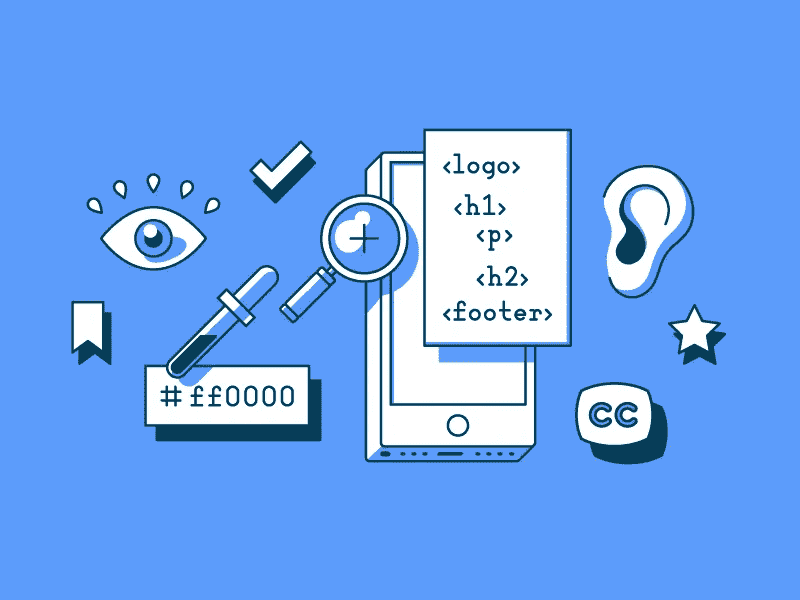

# 让设计随处可及—开始

> 原文：<https://medium.com/swlh/making-design-accessible-everywhere-getting-started-deb59683343e>

构建一些很酷但不是为所有人设计的东西？好吧，在你读完这篇文章后，你应该知道了。

Illustration by [**Alejandro Ramirez**](https://dribbble.com/ivcoti)

我们生活在这样一个时代，人们对 Dribbble([dribblisation of design](https://www.intercom.com/blog/the-dribbblisation-of-design/))上花哨、艺术的用户界面赞叹不已，而不关心产品的功能和可用性。