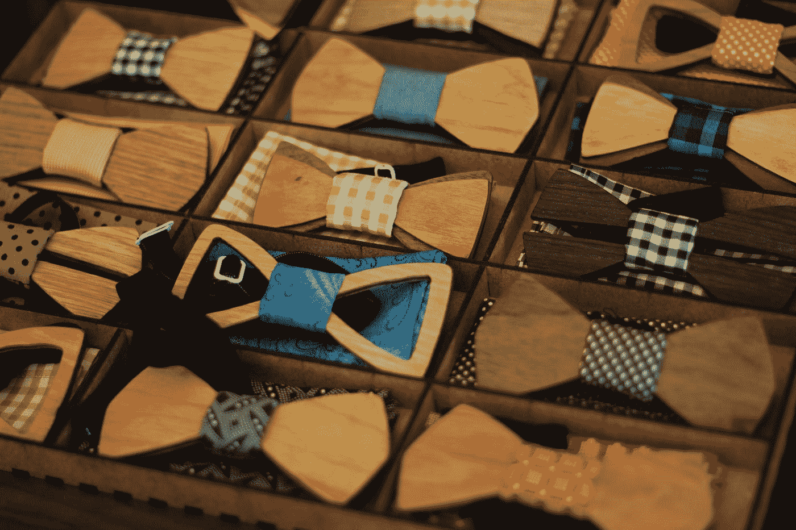

# 让 Drupal 8 Twig 模板更加经典

> 原文：<https://medium.com/swlh/making-field-html-twig-even-classier-5412cb6edcb8>

Photo by [palesa](https://unsplash.com/@palesa08?utm_source=medium&utm_medium=referral) on [Unsplash](https://unsplash.com?utm_source=medium&utm_medium=referral)

如果您对 Drupal 8 中的主题化非常熟悉，那么您可能已经遇到了 core 中打包的经典主题。Classy 是一个基础主题，开发者可以从这个基础主题扩展他们自己的自定义主题。甚至 Drupal 的另外两个核心主题 Seven 和 Bartik 也是从它延伸出来的。