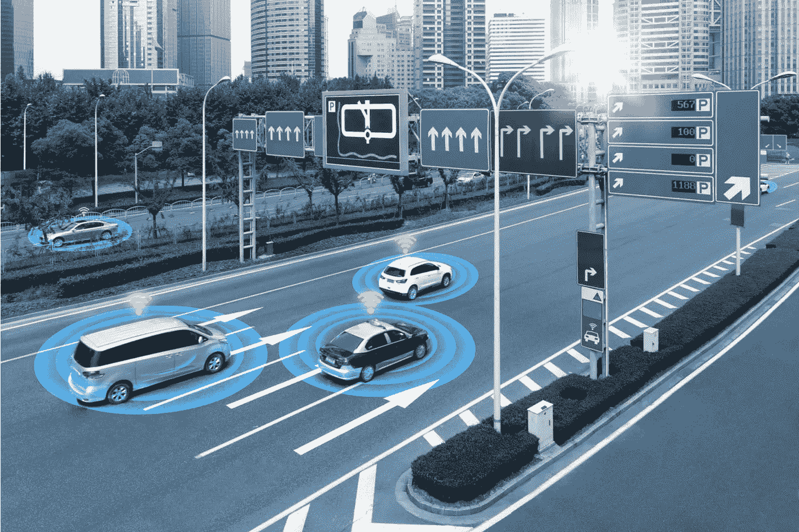

# 从联网汽车中赚钱

> 原文：<https://medium.com/swlh/making-money-from-connected-cars-d2d750d92843>

随着汽车成为最终的联网移动设备，一些赚钱的机会将会出现。

Connected cars offer opportunities beyond the auto sector.

预计到 2025 年，汽车生态系统每年将产生 6000 亿美元的收入，零售、保险、医疗保健、媒体和娱乐领域的商业领袖将与汽车制造商合作，从联网汽车中赚钱。

**如何？**

**对于汽车原始设备制造商**、**而言，空中下载(OTA)更新既能节省成本，又能增加收入。**特斯拉司机可以选择通过空中下载(OTA)软件设施更新他们的刹车(这也节省了他们去服务中心的行程)。特斯拉还通过其增值服务的免费试用交叉销售升级产品(例如，其辅助驾驶系统)。我们预计所有汽车制造商将加强其 OTA 能力，以提供类似的服务，并使他们的车辆更加安全。OTA 还将改善召回合规性和保修维修等其他体验。

**手机服务**如苹果 Carplay 和安卓 Auto 将智能手机功能转移到汽车的内置显示屏上，使司机能够在专注于道路的同时获取方向、拨打电话、发送和接收信息以及听音乐。谷歌的 Waze 提供逐路段导航、旅行时间和路线细节。英特尔已经在联网汽车项目上投资了数十亿美元，渴望加入将汽车转变为终极移动设备的运动。

**零售业。**一项研究预测，到 2023 年，联网汽车电子商务平台的交易额将达到 2650 亿美元[。亚马逊预计将成为推出 Alexa Auto 的最大受益者，Alexa Auto 配备了一个仪表板支架，并在自己的实时操作系统上运行。通用汽车的](https://www.juniperresearch.com/press/press-releases/in-vehicle-commerce-opportunities)[车载应用](https://www.autonews.com/article/20171211/OEM06/171219948/marketplace-showcases-gm-s-remote-update-capability)也支持零售交易，上汽和阿里巴巴在中国的[合资企业](https://www.reuters.com/article/us-saic-motor-alibaba-group/chinas-saic-motor-alibaba-to-invest-160-million-in-internet-connected-cars-idUSKBN0M80S920150312)也是如此。

**广告、定向营销和娱乐。**在不久的将来，随着传感技术显示他们的油箱几乎空了，司机将获得折扣燃油优惠(使这种优惠看起来更像增值内容而不是广告)。在娱乐领域，SiriusXM 卫星广播继续扩大其 3300 万用户群。优步与 Spotify 和 Pandora 的协议允许消费者在使用拼车服务时收听他们的播放列表。有 Wi-fi 功能的车辆可以让你在长途旅行中观看网飞、亚马逊 Prime 和 Hulu 节目。

**在保险业**，基于使用的程序正在从通过[车载诊断设备](https://en.wikipedia.org/wiki/Onboard_diagnostics)收集的数据中涌现出来。我们预计其他技术的采用会增加，如 t [电子设备](https://en.wikipedia.org/wiki/Telematics)以影响驾驶行为并帮助减少保险欺诈。远程信息技术还将用于指导司机提高燃油效率、安全性和预测性维护(以及关于保险升级或最佳售车时间的建议)。

**汽车制造商如何处理联网汽车的业务问题？**

**在安全和隐私方面的投资增加。**汽车高管开始让安全和风险负责人管理联网汽车的网络安全(网络安全是 Gartner 2019 年技术高管调查中汽车首席信息官的首要关注领域)。标准(包括 [ISO/SAE 21434](https://www.iso.org/standard/70918.html) 和联合国网络安全任务组[une ce WP29](https://www.unece.org/fr/transport/areas-of-work/vehicle-regulations/reglementation-des-vehicules-accueil.html))也正在走向成熟。在消费者隐私方面，汽车营销人员正在起草简单易懂的协议，解释联网汽车数据将如何匿名化和货币化，以及消费者将如何受益。

**新的组织结构正在形成**。从车辆中捕获数据、分析数据、路由数据和存储数据的能力超出了大多数汽车 it 组织的能力。这种情况需要改变，因为大多数汽车原始设备制造商缺乏通过无线方式提供更新的组织基础设施。熟练的 OTA 开发人员也将受到欢迎。此外，汽车行业的技术经理将需要为持续的软件更新制定持续的计划(而不仅仅是对错误和问题做出反应)。合作伙伴协议也在修改，以规定供应商的软件将如何更新。

**汽车联盟正在解决存储问题**。到 2025 年，车辆数据每月可以产生[10eb](https://aecc.org/automotive-edge-computing-consortium-shifts-connected-car-market-high-gear/)(比现在的数据量大 10000 倍)。因此，汽车行业将在数据中心投资数十亿美元来存储和处理联网汽车信息。作为回应，汽车边缘计算联盟正在设计新的网络和存储架构，以便更容易地存储和处理联网汽车数据。汽车制造商也在研究过滤策略，以获取不是所有的数据，而是正确的数据。

**总之**

互联经济正在刺激数十亿美元的增值服务，特别是汽车行业，因为强大的连接模糊了传统的行业界限。因此，营销人员应该积极研究如何利用相邻行业的创新来获得新的增长机会。