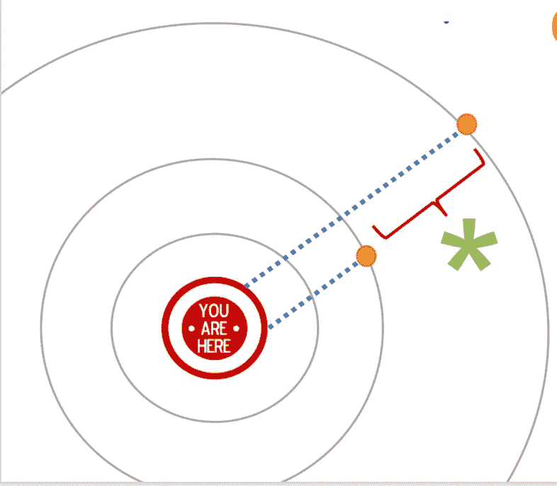

# 充分利用远程思维

> 原文：<https://medium.com/swlh/making-the-most-out-of-remote-ideation-495a40e615ef>

> “获得好的**想法**的方法是获得大量的**想法**，并扔掉不好的想法。”——莱纳斯·鲍林

在构思的过程中，最重要的部分是保持正念，不做判断，想出疯狂/创新的想法。作为构思会议的主持人，为你的同事创造一个安全的空间是非常重要的，确保我们鼓励即使是愚蠢的想法，这样我们就可以尽可能多地提取。让我们的同龄人不评判他人成为一种规范。

我们的目标是产生尽可能多的想法，不管它们是否可行。然后再把不好的补上。

我们想从构思环节中获得的是绿色星号。如果你在分享你的想法之前先对其进行判断，我们会走到第二圈。然而，如果我们被鼓励分享所有类型的想法，即使是疯狂的想法，我们也会走到最外面的圈子。绿色星号是创新发生的地方。

必须促进面对面的互动已经是一项日常挑战，因为我们希望让所有同事都处于正确的心态和时间框架中，以充分利用每个人的时间。然而，在远程办公室工作时，我们不能依赖面对面的交流。我们需要依靠技术。不同之处在于，你永远不知道在那一个小时的会议中，某一天的互联网连接是否会出现问题，或者某人在虚拟创意工具上发表想法时是否会被踢出会议，或者声音是否正常。

**远程思维问题:**

**场景 1:** (6 分钟构思)工具: [Realtimeboard (Miro)](http://miro.com) 参与者:5 人

时间开始后，只有 3 个人能够访问公告板，其他 2 人必须等待张贴他们的想法。这就造成了不一致，当他们打算输入想法时，这种刺激已经消失了。在这一点上，时间拳击并没有真正的帮助。

**场景 2:** (10 分钟的讨论)工具: [Realtimeboard (Miro)](http://miro.com) 参与者:5

因为这是一次虚拟的协调，并不是每个人都理解我们试图解决的问题的全貌。这反过来又为我们提供了很少的解决方案，因为我们的同行并不完全了解环境。

**一些解决方案:**

不得不与纽约办公室进行远程会议，以下是我在一年的时间里尝试的一些方法，它们最终奏效了！

**赛前:**

1.  在另一边有人帮助你。在我目前的情况下，我的工作地点在柏林，但我们的总部和大多数面向客户的部门都在纽约。因为，我在纽约不能控制任何事情，有一个理解你的流程的人在另一边帮助你真的很好。

*   试着解释一下构思的概念，以及你想从这个环节中获得什么。如果是面对面进行，正常的构思会议大约需要 30 分钟，但在这种情况下，我们必须依靠技术安装和一些虚拟设置，因此将其作为 1 小时的会议。
*   无论对方是首席工程师、产品经理还是团队领导，我们都需要建立一种关系，在这种关系中，我们真正理解本次会议的目的。让他或她知道，我们希望我们的同龄人产生疯狂的想法，而不是评判他人。让他们提前想出一些疯狂的想法，以防我们在构思过程中陷入困境。向对方简要介绍我们在本次会议中解决的问题。
*   确保你给好奇心留下尽可能少的空间，因为这个人需要足够好地理解你的过程来帮助你传达背景。

**2。永远知道你的问题陈述。**在没有做足够的研究之前，永远不要开始构思会议。

*   你希望能够告诉你的同行为什么我们要这样做，为什么这是一个问题。因此，在本次会议之前，请确保您有足够的关于我们的用户的信息，并清楚地确定我们的问题。在这节课中，我们可以把它分成两节:定义+构思或者仅仅是构思。然而，如果你想做 Define+Ideate，确保问题陈述足够小，以产生许多“我们如何能…?"问题。
*   更多情况下，我会尝试提前与产品经理一起从我们的问题陈述中定义机会，并选择“我们如何能够……”与我们的业务问题最相关的问题。这将缩短我们对焦点问题进行分类所花费的时间，并允许我们的项目经理在出现声音缺陷的情况下帮助我们的同事解决某些问题。

**3。准备一个可视化的用户旅程或我们问题的可视化。**因此，我们希望我们的同行能够跟上我们发现的问题，但我们也想向他们请教某些解决方案。从这次会议中获得最大收益的最好方法是当每个人都像我们一样理解这个问题的时候。

*   让我们的同伴更容易做到这一点的最简单的方法就是用最简单的方式向他们展示我们的发现。一个很好的经验法则是，如果有人能在 10 秒钟内理解它，那就足以传达我们的问题了。
*   在我们的可视化中使用最少的单词。我们也可以展示一个同理心地图，它在说:做，想:感觉的基础上提供信息。
*   使用一个时间表旅程或一步一步的旅程，如果可能的话增加一些百分比。
*   强调一些来自我们用户的重要引用。只有重要的引用。

**构思时间:**

请记住，我们只有一个小时的会议时间，我们不应该拖延会议，浪费同事的时间。花点时间从上面准备你需要的文件或资源，为构思做好准备。

1.  **创造安全的空间。**提醒你的同事，这是一个安全的空间，每个解决方案都是好的解决方案，当一个人说话时，我们所有人都应该尊重和倾听，我们不会评判任何人的想法。
2.  **想起以前手里的疯狂方案。**我会事先想出疯狂的解决方案，只是为了在人们没有主意，需要一些指导来走得更远的时候处理尴尬的局面。我的解决方案不一定是可能的，但它必须足够疯狂，以帮助我们的同行跳出框框思考。
3.  仔细解释你的问题陈述。同样，我们希望达成共识，确保我们解决的是同一个问题。这一步和同情我们的用户一样重要。
4.  **要有耐心。在构思过程中，任何事情都可能出错，尤其是远程构思的时候。无论是互联网连接、chrome 盒子发出的声音，还是你无法从屏幕上看到的板上的便利贴，等等。耐心点，相信你另一边的协调人。**

**总结构思:**

第一次会议总是最难的，但是第一次会议中简单的反馈，如“我喜欢”和“我希望”，会让我们知道下次如何改进。

在构思会议之后，你应该会得到许多有用的想法。将它们分成相关的类别，并投票选出我们最想尝试的类别。

最终，面对面的交流总是更容易。然而，无论是面对面还是远程，我们都希望实现同样的目标，在短时间内拿出明智的解决方案。

当然，当远程思维变得太难时，你可以尝试独自完成。**但是记住，如果你想走得快，就一个人走。但如果你想走远，那就一起走。**

快乐构思每个人！