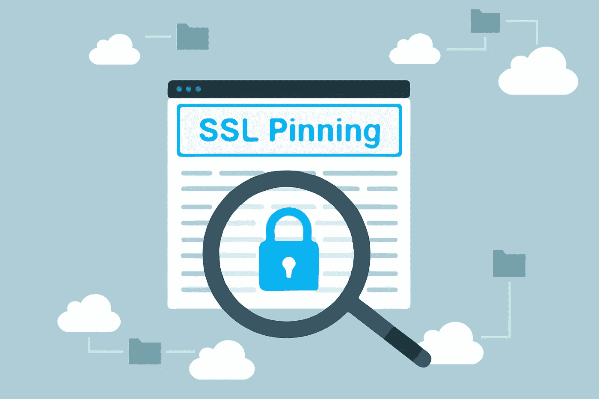

# 使用 SSL pin 使您的 iOS 应用程序更加安全

> 原文：<https://medium.com/swlh/making-your-ios-app-more-secure-with-ssl-pining-92f41fb72a80>

如今，在使用 SSL(安全套接字层)保护我们的服务器之后，我们感到很安全，SSL 是一种用于在客户端和服务器之间创建加密连接的协议。它确保所有在网络中传递的数据都是私有的和完整的。虽然 SSL 通信在现实时间框架内被认为是非常安全和不可破解的，但中间人攻击仍然构成实际威胁。