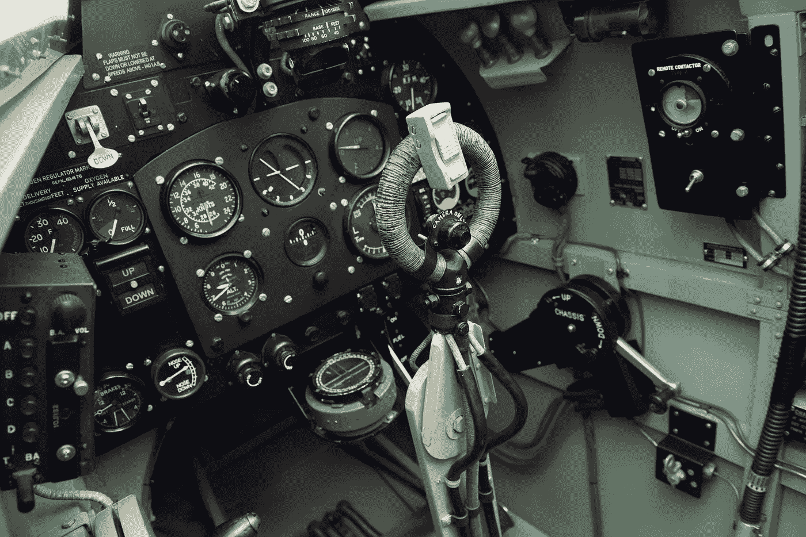

# 人、机器、飞机

> 原文：<https://medium.com/swlh/man-machine-plane-860c105a3d3c>

> “在事故极其罕见的时候，每一次事故都是一次性事件，不太可能详细重复。下一次将会是其他航空公司……和其他一些失败——但几乎肯定会涉及自动化，当它发生时会困扰我们。”–威廉·兰格威斯特，名利场，2014 年 10 月

飞机在开始下降前是在高空。非常高。

我告诉飞行员他们离机场 39 英里。

短暂的停顿后，他敲了敲麦克风——“电脑还没告诉我们开始关机。”

抛开决策不谈，从技术上讲，飞行并没有那么难。此外，许多飞机能够自己飞行。自动化是每架新型客机的一部分。自动驾驶仪在起飞后不久接通，并一直保持到着陆前几百英尺。

# 我们是如何来到这里的

自动驾驶仪是为了让飞行更安全。的确如此。

航空事故越来越少了。许多著名的灾难都源于一个潜在的威胁，这个威胁已经通过大量的安全研究得到了证实——飞行员失误。

如果人类是罪魁祸首，补救措施似乎很简单——将飞行员的角色从稳定的驾驶员转变为系统管理者。

现代自动驾驶仪的飞行精度比人更高，并为飞行员提供了一些监控飞行进程的空间，比手动飞行少了一步。飞行员可以啜饮咖啡，扫描玻璃驾驶舱中的面板，确保系统正常运行。他输入数据并转动拨号盘，但只是在“不太可能发生的紧急情况下”才触摸控制装置。

航空公司传统上是根据经验进行招聘的，以飞行时间来量化。也就是说，在自动驾驶仪上监控一架飞机进行自我校正，与评估一架漂浮飞机在阵风条件下在高海拔山区湖泊降落或在森林大火中洒水的体验质量不同。因此，为了巩固他们的技能，过去的飞行员必须在达到梦寐以求的航空公司工作所需的小时数之前“北上”磨练。

今天，由于飞行员招聘的激增，大多数新培养的商业飞行员在被地区航空公司雇用之前，不需要花太多时间在穷乡僻壤飞行。因此，随着自动化的兴起，以及现代客机所需的系统知识，似乎有理由认为，老式的驾驶杆和方向舵技能在当代飞行员培训课程中可能不会像过去那样占有一席之地。

看看最近备受瞩目的航空事故就知道了一个不同的故事。

# 飞行理论

失速改出是学习飞行的基本要素之一。

相对气流和机翼弦之间的角度称为迎角。随着迎角的增加，升力增加，直到达到临界迎角(大约 15 度)。此时，流过机翼顶部的空气无法附着在弧面上，升力突然开始下降——飞机失速。

飞机失去高度，改出变得反直觉。拉回控制杆不再导致飞机增加高度——它加深了失速。飞行员必须与自己的本能作斗争，向前推动控制杆以减小迎角，从而打破失速。

2009 年，法航 447 的机组人员未能采取这一关键行动。这样做可以防止笨重的空客飞机坠入大西洋。

最近发生的狮航 610 和埃塞俄比亚航空 302 事件可能更令人不安。一个旨在防止飞机失速的系统将飞行员撞向地面。

# MCAS

737 MAX 上发动机的尺寸和位置对飞机的重心有潜在的麻烦影响。一些人认为巨大涡轮的前部位置增加了起飞时失速的风险。

一种技术解决方案被开发出来并命名为 MCAS——机动特性增强系统。这是一个旨在推动机头向前的程序，因此，如果飞行员增加迎角太多，就执行失速改出协议。

它应该像你的汽车中的牵引力控制系统一样工作——这是一个你没有想到的安全功能，但如果你需要它，它就在那里。

在最近的事件中，MCAS 可能已经接管，因为飞机认为它即将失速。这些故事现在已经被很好地讲述了。飞行员们被留下来与一架低空颠簸在地平线以下的飞机搏斗。

波音公司已经发现了这个问题，并在公告中记录了修复过程。飞行员本可以关闭水平安定面的自动控制，但是现在很明显一些飞行员不知道怎么做。

# 这对飞行员意味着什么

自动化使飞行更加安全。然而，这使得异常情况变得更加不可预测。

虽然飞行员不得不处理飞行中的紧急情况的可能性越来越小，但当紧急情况发生时，最有可能的反应是对自动系统进行故障排除。

几年来，主要的飞机制造商已经在他们的飞机上模拟了力控制反馈。该软件给飞行员一种感觉，当她移动控制杆时，她可以“感觉到飞机”，但这是一种错觉。

不管是好是坏，棍子和舵的时代已经过去了。今天，飞行员的工作要求可能会发生变化，但重要的是要记住，当事情出错时，最后一道防线仍然是飞行员的手和脚，以及她指挥飞机的能力。

更多故事由詹姆斯·马拉沙在 jamesmarasa.com**。**