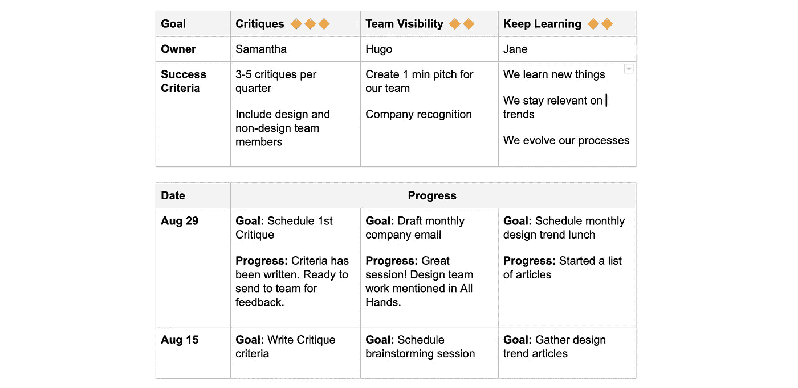
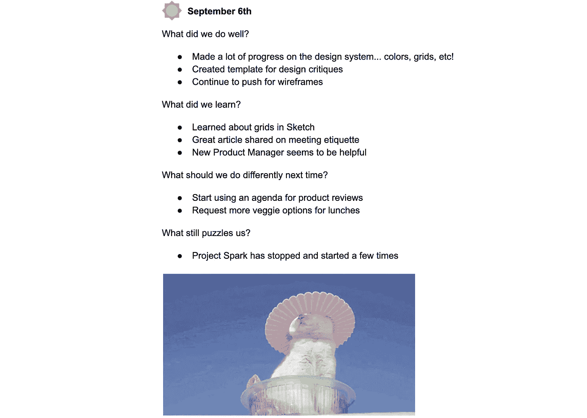

# 管理:快乐团队的 5 个步骤

> 原文：<https://medium.com/swlh/management-5-steps-to-a-happy-team-f6951676a6d1>

Image elements by ManyPixels

让我们把它放在外面。管理并不适合所有人。大多数经理虽然可能是伟大的领导者，但不是伟大的人事经理。还有一些人引导创新，建立伟大的团队，培养不可思议的个人。

如果你对管理感兴趣，首先，问问自己为什么。你想当经理还是想升职？希望答案是你想在你所做的事情上做得很棒，并建立在你自己的天赋之上。对于经理来说，这通常意味着对以下方面的天赋:

*   倾听(我所说的倾听是指不说话)
*   发现和培养他人的才能
*   为他人辩护

我们都花了大量的精力寻找正确的职业道路，但是一旦有了晋升的希望，就很容易掩饰自己是否真的适合这个角色。所以别说了。问问你自己。我们都看到了没有天赋的管理者的影响。

从我职业生涯的一开始，我就知道了这些经理的连锁反应。它卡住了。

我的第一个老板属于可怕的那一类——一个午餐时间喝酒的人，他把所有的工作都推给我。随着时间的推移，作为一个早期的高成就者，我的工作经历中充满了怨恨。

我的下一任老板恰恰相反，这也是我所渴望的——极其严格，而且极具激励性。有时我无法忍受她，但是过去的经历和我进步的速度激励我坚持下去。这是我第一次看到一个伟大经理的影响。

这让我看到了硬币的两面。24 岁时，一个兴趣被激发了，我被安排去指导一个新的设计师。在我的职业生涯中，我一直喜欢管理，十年后，我管理着一个设计师团队。虽然我可能每天都不被人喜欢，但我总是因为我所扮演的角色而受到感谢，并听说我们拥有最快乐的团队:)。

以下是我在管理个人和团队时经常提到的 5 件事。

# 1.从倾听开始

当加入一个新团队时，我想了解个人、团队如何运作以及工作本身。我与每个人见面，通常是开始我们的一对一会谈，然后与小组成员见面。在小组中，我会通过便利贴形式的活动或讨论来收集:

1.  日常生活是什么样的？
2.  什么在起作用？
3.  什么没用？

我不会解决所有问题，但我想知道我们现在的状况。我将收集我对团队会议和节奏的想法，以及我们可以努力改进的流程漏洞。我喜欢以这样一个典型的节奏开始:

*   **每周评论**
*   **周五回顾会**
*   **季度目标(每两周检查一次)**
*   **一对一(每周或更少)**

每周回顾将团队聚集在一起，分享任何新闻，并回顾所有项目的状态。如果出现团队成员工作过多或过少的情况，这有助于我们根据需要调整工作。我还要求团队分享新作品(因为我们是设计师，所以很容易做到)，以保持我们的灵感和协作。

周五回顾，目标和一对一详细如下。

结构非常有用，但是太多了就不好了。着眼于适应能力，我在最初的几个星期里参加了这些会议。几乎任何事情都有待重新评估。

我想从一开始就传达的信息是，

> “我是领队，但这是**我们团队**。我需要你的反馈，我希望我们所有人都能感受到主人翁精神，感受到动力，成长并享受这份工作。”

# 2.一对一

最终，个人动力可以成就一个团队，也可以毁掉一个团队。这使得一对一成为最好的开始，也是最重要的会议。

我喜欢按照宽松的 **10/10/10** (其中 10 分钟用于倾听员工，10 分钟用于经理回应，10 分钟用于共同讨论)回答以下问题:

*   你过得怎么样？什么进展顺利？有哪些可以改进的地方？
*   作为你的经理，我该如何改进？
*   你的动机是什么？短期目标？长期目标？

# 3.目标

设定和维护团队目标使我们能够检查哪些是有效的，哪些是无效的，并找到保持积极性和参与度的新方法。我们的目标是每季度设定一次目标，并使(至少部分)我们的目标与公司目标或使命保持一致。

团队第一次创建目标时，我们从便利贴活动开始。

*   **简介:**每个团队成员都会得到一叠便利贴和一支记号笔(为了方便查看)。我举了几个例子来说明一些可能的目标。
*   **5-10 分钟活动:**每个人在每张便利贴上写下一个目标的想法。没有坏主意——数量重于质量——我也加入其中。(另一个选项是[开始、停止、继续](https://gamestorming.com/start-stop-continue/)活动。)
*   **回顾:**每个团队成员轮流将他们的便利贴贴在白板上，并解释每一条。在我们进行的过程中(或结束时)，我得到了团队的帮助，将相似的想法聚集在一起。如果公告板看起来势不可挡，我们将命名每个集群，并添加一个标题便利贴。
*   **选择:**给每个团队成员 3+点贴纸，让他们在包含他们最感兴趣的本季度目标想法的便利贴上做标记。
*   **讨论:**我们喜欢上面的选择吗？
*   **记录:**一旦我们达成共识，我会在一个共享的文档中记录和组织目标。对于最高目标，我们共同决定成功标准和每个*的所有者。*(如果觉得会议太长，可以在单独的会议中进行。)

我们每两周跟进一次，每次都设定小目标并记录我们是如何跟踪的。每周达不到目标是可以的，但这有助于每个人看到进步，检查并保持动力。当然，目标会随着时间的推移而改变。

在季度末，我们进行回顾，以指导我们希望下一季度的目标如何进行。

Example Team Goals

# 4.回顾展

为了总结每一周，我们会在周五举行团队回顾会。我越来越喜欢 Norm Kerth 的回顾(感谢一位伟大经理的建议；).没有这种结构，事情会变得有点糟糕。

*   我们做得好的是什么？
*   我们学到了什么？
*   下次我们应该做些什么不同的事情？
*   还有什么让我们困惑？

这是把事情说出来的时候，而不是解决问题的时候。然而，有时我会在最后问团队，如果我采取行动，是否可以。

> “不管我们发现了什么，我们理解并真诚地相信，根据当时已知的情况、他或她的技能和能力、可用的资源以及手头的情况，每个人都尽了最大努力。”
> 
> *— Norm Kerth，*项目回顾:团队回顾手册

回顾最常用于项目结束时，但不需要等待！当事情还在进展中的时候，加入复古元素会让你有机会一路进步。

这些年来，我们的团队尝试了各种各样的补充。比如从复古中选择一件下周重点关注的物品，或者使用表情符号和 gif 来营造本周氛围。

Example Weekly Team Retrospective

# 5.换一个

我和我的团队一起不断学习和成长。提醒自己这一点很重要。我并不更好或更重要。我只是有一个不同的角色来帮助团队前进。

我需要团队的反馈，我希望我们都有主人翁感。*会议太多？协作不够？更多的相处时间？问了才知道！*

以下是我们多年来尝试过的一些事情，当然，不是一下子就能做到的。其中大部分来自我们的目标会议，并持续了一两个季度。

*   设计日:作为一个团队在一个设计项目上工作的一段时间。
*   **设计评论:**一名团队成员要求团队提供具体的反馈。
*   **传授技能:**每个团队成员选择一些东西教给小组。
*   **团队跟踪:**如果团队成员是某个工具的专家，观察他们使用它。
*   **团队项目:**例如，历时数月创建一个设计系统。
*   **上个课:**比如 IDEO 的以人为中心的设计课程。
*   **参与设计社区**
*   **志愿者项目**
*   **团队聚餐**

# 这是很多

我知道你要说什么。这是很大的工作量。是的，没错。还有很多时间。有时候很难腾出空间来完成“真正的工作”。有时，我试图以个人贡献者的身份承担完整的项目，并为自己不能坚持到底而自责。

对我有帮助的事情……封锁大量的“忙碌”时间，说不，当事情变得疯狂时分散会议。但对我来说，管理就是支持团队和团队的工作。如果我能挤在这里或那里成为个人贡献者，那就是锦上添花。最后，如果团队成功了，我也成功了……被重视了……有价值了(这完全是另一个兔子洞)。

# 要读的书

首先，打破所有规则:世界上最伟大的经理人有哪些不同的做法

团队的五种功能障碍:一个领导寓言