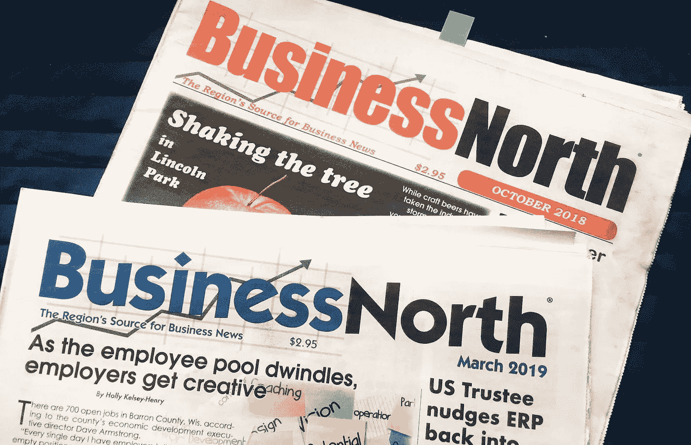

# 管理时尚:买家当心

> 原文：<https://medium.com/swlh/management-fads-buyer-beware-7db2d82964bf>

“不管你是什么，做一个好人。”—亚伯拉罕·林肯

Photo by the author. One of the publications I continue to write for.

人类的一个迷人现象是我们像旅鼠一样的跟风倾向。从吞金鱼到宠物石、呼啦圈、溜溜球到连锁信，美国已经成为各种狂热的温床[。](/@ennyman/the-madness-of-crowds-18ed921eaf77)

有趣的是，当这些孩子长大后，他们经常继续做他们一直在做的事情:跟随…