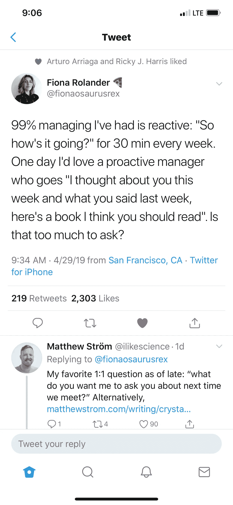

# 领导是教练；开始表现得像它

> 原文：<https://medium.com/swlh/managers-are-coaches-start-acting-like-it-254d4d020406>

不要让这个场景代表你的管理风格…

管理不是管理，只是友谊。

我们能不能不要表现得好像生意和我们的余生不一样？

更具体地说:管理就是领导，如果你能搞清楚领导(&添加约束)，你就有了管理。