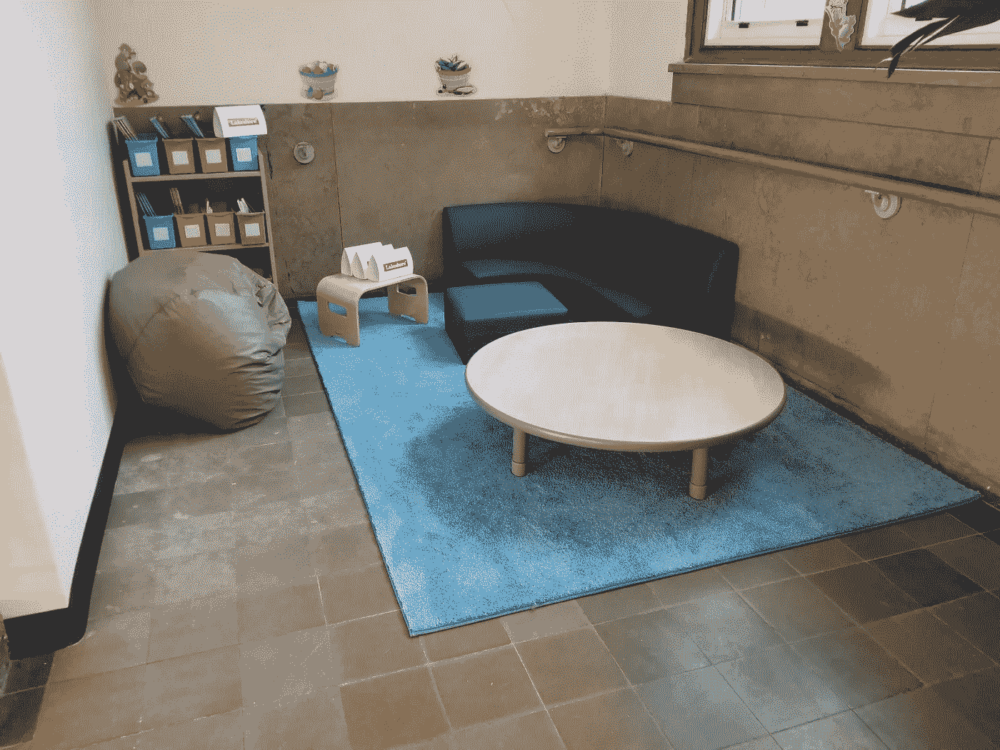

# 围绕学习空间设计的叙事管理

> 原文：<https://medium.com/swlh/managing-the-narrative-around-learning-space-design-b2e75a9f9f1b>

*此文最初发表于* [*此处*](https://www.smartbrief.com/original/2019/06/managing-narrative-around-learning-space-design?utm_source=brief&utm_medium=FeaturedContent&utm_campaign=EducationOriginals)

空间设计已经脱离正轨。在太多的教室里，这相当于本末倒置。整洁、花哨和可爱已经成为常态，但现实是装饰教室实际上会对学习产生负面影响。对许多人来说，空间设计不是为了加速现代学习，而是为了…