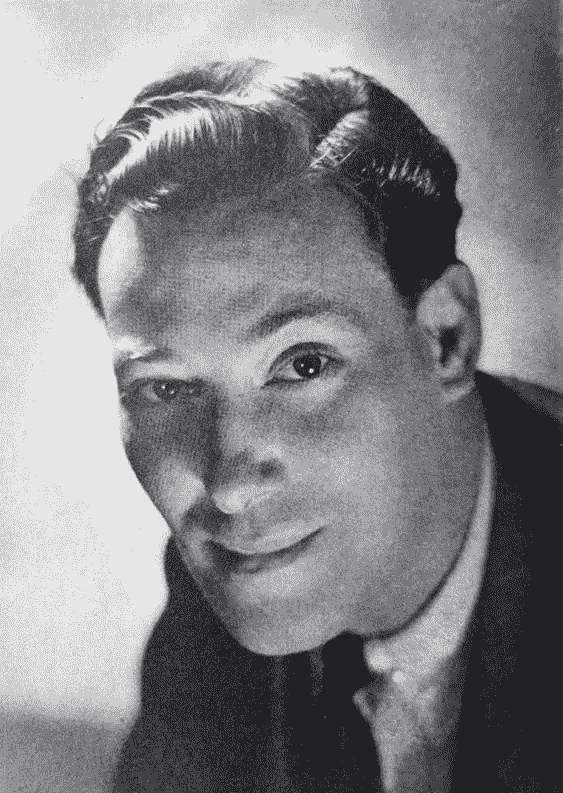

# 展现与选择我们想要的结果

> 原文：<https://medium.com/swlh/manifesting-vs-selecting-our-desired-outcome-e72a3dbf1c72>

The late, great Neville Goddard (1905–1972). Source: [harvbishop.com](https://www.harvbishop.com/neville-goddard-a-cosmic-philospher/)

*对新时代租户的不同看法*

P 从巴诺书店的《新时代/自我转变》系列中挑选几乎任何一本书，或者细读 YouTube 上的《吸引力法则》视频，你会发现一个核心概念一直在循环:渴望结果的“显现”(无论是浪漫、更多的钱、新的职业、更好的健康等等)。).是否完成于…